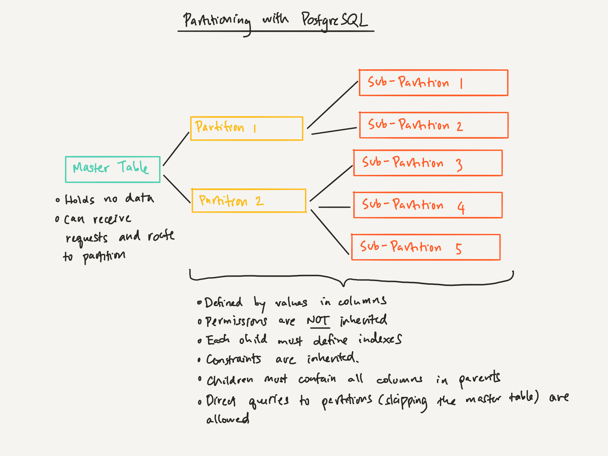

## Create Partitioned Table

`PostgreSQL`에서 파티셔닝을 수행하려면, 먼저 `Master Table`을 생성하고, 그것을 이용하여 `Partitioned Table`을 생성해야 합니다. 다시 `Partitioned Table`을 사용하여 `Sub-Partitioned Table`을 생성할 수 있습니다.



---

### 테이블 정의 구문

일반 테이블을 정의하는 구문에서 사용된 옵션을 모두 사용할 수 있습니다. 따라서 `chapter 01`에서 이미 설명된 내용은 생략합니다.

```sql
-- MASTER TABLE
CREATE TABLE master_table_name (
    ~~ 컬럼 정의 구문 중략 ~~
)
[ PARTITION BY { RANGE | LIST | HASH } ( { column_name | ( expression ) } [ COLLATE collation ] [ opclass ] [, ... ] ) ]
[ TABLESPACE tablespace_name ]

-- PARTITIONED TABLE
CREATE TABLE partition_table_name
PARTITION OF master_table_name
{ FOR VALUES partition_bound | DEFAULT }
[ TABLESPACE tablespace_name ]

-- PARTITION SPEC
IN ( partition_bound_expr [, ...] ) | -- FOR LIST PARTITION
FROM ( { partition_bound_expr | MINVALUE + MAXVALUE } [, ...] )
  TO ( { partition_bound_expr | MINVALUE + MAXVALUE } [, ...] ) | -- FOR RANGE PARTITION
WITH ( MODULES numberic_literal, REMAINDER numberic_literal ) -- FOR HASH PARTITION
```

<br/>

### 상세 설명

-   `PARTITION BY { RANGE | LIST | HASH } ( { columns | ( expression ) }`

주어진 `column(s)` 또는 `expression`의 값을 기준으로 `RANGE | LIST | HASH` 방식으로 파티셔닝합니다.

<br/>

**RANGE :**

`단일컬럼` 또는 `다중컬럼`을 연속적인 범위(`FROM ... TO ...`)로 나누어 저장합니다. 관리하기 쉽지만 특정 범위에 값이 집중되면 성능 불균형이 발생할 수 있습니다.

```sql
-- MASTER
CREATE TABLE test (
    x int,
    y int
)
PARTITION BY RANGE ( x );

-- PARTITION
CREATE TABLE test_p1 PARTITION OF test FOR VALUES FROM (MINVALUE) TO (0);
CREATE TABLE test_p2 PARTITION OF test FOR VALUES FROM (0) TO (10);
CREATE TABLE test_p3 PARTITION OF test FOR VALUES FROM (10) TO (20);
CREATE TABLE test_p4 PARTITION OF test FOR VALUES FROM (20) TO (MAXVALUE);
```

※ 삽입할 데이터에 대응되는 파티션이 없으면 하면 에러가 발생합니다.

<br/>

**LIST :**

`단일컬럼` 또는 `다중컬럼`을 이산적인 범위(`IN ...`)로 나누어 저장합니다. 잘 분할되었다면 괜찮지만, 그렇지 않으면 성능이 더욱 하락하기 때문에, 컬럼값이 고정적이고 수가 적을때만 적용해야 합니다. 나중에 컬럼값의 요구조건이 변경되면 낭패를 보기 쉽습니다.

```sql
-- MASTER
CREATE TABLE test (
    x int,
    y int
)
PARTITION BY LIST ( x );

-- PARTITION
CREATE TABLE test_p1 PARTITION OF test FOR VALUES IN (1, 5, 7, 8);
CREATE TABLE test_p2 PARTITION OF test FOR VALUES IN (2, 3, 4, 9);
CREATE TABLE test_p3 PARTITION OF test FOR VALUES IN (0);
```

※ 삽입할 데이터에 대응되는 파티션이 없으면 하면 에러가 발생합니다.

<br/>

**HASH :**

`단일컬럼` 또는 `다중컬럼`을 모듈러 함수의 결과(`WITH ...`)로 나누어 저장합니다. `MODULUS = N`이라면 당연히 `REMAINDER`의 범위는 `(0, N)`으로 고정됩니다. 데이터의 골고루 잘 분산되는 장점이 있지만, 데이터가 어느 파티션에 저장될지 예상할 수 없기 때문에 데이터 관리성은 하락합니다.

```sql
-- MASTER
CREATE TABLE test (
    x int,
    y int
)
PARTITION BY HASH ( x );

-- PARTITION
CREATE TABLE test_p0 PARTITION OF test FOR VALUES WITH (MODULUS 5, REMAINDER 0);
CREATE TABLE test_p1 PARTITION OF test FOR VALUES WITH (MODULUS 5, REMAINDER 1);
CREATE TABLE test_p2 PARTITION OF test FOR VALUES WITH (MODULUS 5, REMAINDER 2);
CREATE TABLE test_p3 PARTITION OF test FOR VALUES WITH (MODULUS 5, REMAINDER 3);
CREATE TABLE test_p4 PARTITION OF test FOR VALUES WITH (MODULUS 5, REMAINDER 4);
```

---

### 서브 파티셔닝

최대 2번까지 서로다른 방식을 사용하여 파티션을 나눌 수 있습니다.

```sql
-- MASTER
CREATE TABLE test (
    x int,
    y int
)
PARTITION BY HASH ( x );

-- PARTITION
CREATE TABLE test_p0 PARTITION OF test
FOR VALUES WITH (MODULUS 5, REMAINDER 0)
PARTITION BY RANGE ( x );

-- SUB-PARTITION
CREATE TABLE test_p0_1 PARTITION OF test_p0
FOR VALUES FROM (5) TO (10);
```

---

### 계산식을 이용한 파티셔닝

컬럼만이 아니라 계산식을 괄호로 묶어서 파티셔닝 기준으로 사용할 수 있습니다.

```sql
CREATE TABLE test (
    x int,
    y int
)
PARTITION BY HASH ( (x * y) );

-- PARTITION
CREATE TABLE test_p0 PARTITION OF test FOR VALUES WITH (MODULUS 5, REMAINDER 0);
CREATE TABLE test_p1 PARTITION OF test FOR VALUES WITH (MODULUS 5, REMAINDER 1);
CREATE TABLE test_p2 PARTITION OF test FOR VALUES WITH (MODULUS 5, REMAINDER 2);
CREATE TABLE test_p3 PARTITION OF test FOR VALUES WITH (MODULUS 5, REMAINDER 3);
CREATE TABLE test_p4 PARTITION OF test FOR VALUES WITH (MODULUS 5, REMAINDER 4);
```

---

### 성능에 관하여

먼저 예제로 사용할 테이블을 정의하겠습니다.

```sql
-- MASTER
CREATE TABLE test (
    x int,
    y int
)
PARTITION BY HASH ( x );

-- PARTITION
CREATE TABLE test_p0 PARTITION OF test FOR VALUES WITH (MODULUS 5, REMAINDER 0);
CREATE TABLE test_p1 PARTITION OF test FOR VALUES WITH (MODULUS 5, REMAINDER 1);
CREATE TABLE test_p2 PARTITION OF test FOR VALUES WITH (MODULUS 5, REMAINDER 2);
CREATE TABLE test_p3 PARTITION OF test FOR VALUES WITH (MODULUS 5, REMAINDER 3);
CREATE TABLE test_p4 PARTITION OF test FOR VALUES WITH (MODULUS 5, REMAINDER 4);
```

<br/>

**먼저 인덱스부터 :**

`PARTITION KEY`에 사용된 컬럼들은 항상 조회되기 때문에, 반드시 인덱스를 생성해야 성능상 불이익을 받지 않습니다.

<br/>

**성능이 좋아지는 상황 :**

`PARTITION KEY`의 조건이 이산적으로 명시되어 있다면, 해당 조건에 관련된 파티션만 살펴보기 때문에 성능적으로 유리해집니다.

```sql
SELECT * FROM test WHERE X = 1;
```


<br/>

**성능이 나빠지는 상황 :**

`WHERE`이 없거나 `PARTITION KEY`의 조건이 이산적으로 명시되지 않으면, 데이터가 어느 파티션에 있는지 알 수 없기 때문에 모든 파티션을 훑기 때문에 성능이 저하됩니다. 아래의 쿼리는 모든 파티션을 훑습니다.

```sql
-- WHERE 절이 없음.
SELECT * FROM test;

-- PARTITION KEY에 대한 조건이 없음.
SELECT * FROM test WHERE y = 3;

-- PARTITION KEY에 대한 조건이 이산적이지 않음.
SELECT * FROM test WHERE x > 10;
```


<br/>

`PARTITION KEY`로 `expr`을 사용하고 있는 경우에도 모든 파티션을 훑어봅니다.

```sql
-- MASTER
CREATE TABLE test (
    x int,
    y int
)
PARTITION BY HASH ( (x + y) );

-- PARTITION
CREATE TABLE test_p0 PARTITION OF test FOR VALUES WITH (MODULUS 5, REMAINDER 0);
CREATE TABLE test_p1 PARTITION OF test FOR VALUES WITH (MODULUS 5, REMAINDER 1);
CREATE TABLE test_p2 PARTITION OF test FOR VALUES WITH (MODULUS 5, REMAINDER 2);
CREATE TABLE test_p3 PARTITION OF test FOR VALUES WITH (MODULUS 5, REMAINDER 3);
CREATE TABLE test_p4 PARTITION OF test FOR VALUES WITH (MODULUS 5, REMAINDER 4);
```


---

### 파티션 변경 및 삭제

`ALTER TABLE ... DETACH/ATTACH` 구문을 사용하여 바운드 스펙을 변경할 수 있습니다.

```sql
BEGIN TRANSACTION;
ALTER TABLE test DETACH PARTITION test_p0;
ALTER TABLE test ATTACH PARTITION test_p0 FOR VALUES FROM (0) TO (200);
COMMIT TRANSACTION;
```

-   `DETACH` : 파티션 목록에서 분리합니다.
-   `ATTACH` : 파티션 목록에 삽입합니다.

<br/>

`DROP TABLE` 구문을 사용하여 파티션을 삭제할 수 있습니다. 하위 파티션은 모두 삭제됩니다.

```sql
DROP TABLE { master_name | partition_name | sub_partition_name }
```

---

### 파티션 조회

```sql
SELECT
    nmsp_parent.nspname AS parent_schema,
    parent.relname      AS parent,
    nmsp_child.nspname  AS child_schema,
    child.relname       AS child
FROM pg_inherits
    JOIN pg_class parent            ON pg_inherits.inhparent = parent.oid
    JOIN pg_class child             ON pg_inherits.inhrelid   = child.oid
    JOIN pg_namespace nmsp_parent   ON nmsp_parent.oid  = parent.relnamespace
    JOIN pg_namespace nmsp_child    ON nmsp_child.oid   = child.relnamespace
WHERE parent.relname='parent_name';
```
