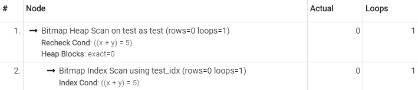
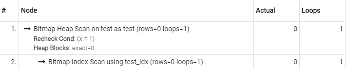
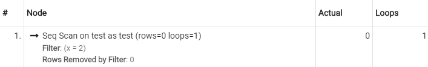

## Create Index

### 기본 구문

```sql
CREATE [ UNIQUE ] INDEX [ CONCURRENTLY ] [ [ IF NOT EXISTS ] name ] ON [ ONLY ] table_name [ USING method ]
    ( { column_name | ( expression ) } [ COLLATE collation ] [ opclass ] [ ASC | DESC ] [ NULLS { FIRST | LAST } ] [, ...] )
    [ INCLUDE ( column_name [, ...] ) ]
    [ WITH ( storage_parameter = value [, ... ] ) ]
    [ TABLESPACE tablespace_name ]
    [ WHERE predicate ]
```

<br/>

### 상세 설명

#### `UNIQUE INDEX`

주어진 컬럼 조합의 값이 중복되지 않도록 제약이 걸린 인덱스를 생성합니다. 예를 들어, 아래의 트랜잭션은 `x=1, y=1`인 행을 2개 이상 삽입하려고 시도하므로 실패할 것 입니다.

```sql
CREATE TABLE test (
    x int,
    y int,
    z int
);
CREATE UNIQUE INDEX ON test ( x, y );
INSERT INTO test VALUES (1, 1, 1), (1, 1, 2);
```

<br/>

#### `CONCURRENTLY`

일반적으로 인덱스를 생성하는 작업은 `Table Lock`을 동반하기 때문에 읽기를 제외한 모든 작업이 미뤄집니다. 이러한 특성으로 인덱스를 생성하는 도중에는 일반적인 서비스가 불가능하기 때문에, 매우 큰 테이블의 경우에는 몇 시간이나 걸려서 인덱스가 생성되므로 매우 치명적인 문제입니다.

<br/>

일명 `CIC (CREATE INDEX CONCURRENTLY)`로 알려진 이 옵션은 락을 걸지 않으면서 인덱스를 생성하려고 시도하기 때문에, 인덱스를 생성하는 도중에도 쓰기/갱신/삭제 작업을 진행할 수 있습니다. 구체적으로는 다음과 같은 `3 Phase`로 진행됩니다.

-   `1 Phase` : 해당 테이블에 존재하는 트랜잭션이 모두 끝나길 기다린다.
-   `2 Phase` : 모든 트랜잭션이 끝난 시점의 스냅샷을 가져와 `Inital Index`를 생성한다.
-   `3 Phase` : `2 Phase` 진행중에 변경된 데이터를 `Index`에 덧붙인다.

<br/>

인덱스 생성과 트랜잭션을 동시에 진행하기 때문에 일반적인 인덱스 생성보다 더 많은 시간과 메모리가 사용되지만, 락을 걸지 않기 때문에 기꺼이 부담할 수 있는 비용입니다.

<br/>

다만 인덱스를 생성하는 도중에 에러(`Deadlock`, `Unique Violation`, ...)가 발생했다면 이야기는 달라집니다. 실패한 인덱스를 제거하는 대신 `INVAILD` 플래그만 세워두고 그대로 유지되기 때문인데. 이러한 `INVAILD INDEX`는 불완전하기 때문에 쿼리에서 사용할 수 없지만 데이터가 변경되면 `INVAILD INDEX`도 수정해줘야 하기 때문에 불필요한 부담을 떠안고 있는 셈입니다.

<br/>

이러한 이유로 `CONCURRENTLY`를 통해 인덱스를 생성하기 시작했다면 `Index Transaction`이 비정상적으로 멈추지 않았는지 `Invaild Index`가 나타나지 않았는지 주기적으로 체크해야 합니다. 그리고 만약 `Invaild Index`가 나타났다면 `DROP INDEX`로 해당 인덱스를 제거하고 다시 시작하는 것이 좋습니다. `REINDEX`는 테이블에 락을 걸기 때문에 조심해서 사용해야 합니다.

**참고문헌 :**

-   [postgresql.kr - CREATE INDEX](https://postgresql.kr/docs/11/sql-createindex.html#SQL-CREATEINDEX-CONCURRENTLY)
-   [2ndquadrant - CIC](https://www.2ndquadrant.com/en/blog/create-index-concurrently)

<br/>

#### `[IF NOT EXISTS] name`

인덱스의 이름을 명시적으로 지정하여 생성합니다. 중복된 이름이 있다면 에러가 발생하지만 `IF NOT EXISTS`를 함께 사용하면 에러를 발생시키는 대신, 해당 명령을 무시합니다.

```sql
CREATE TABLE test (
    x int,
    y int,
    z int
);

-- 기본 명명규칙을 사용.
CREATE INDEX ON test (x);

-- 이름을 명시적으로 지정.
-- 중복된 이름이 있다면 에러 발생.
CREATE INDEX idx_test_x ON test (x);

-- 이름을 명시적으로 지정.
-- 중복된 이름이 있다면 인덱스 생성 명령이 무시됨.
CREATE INDEX IF NOT EXISTS idx_test_x ON test (x);
```

<br/>

#### `ONLY`

부모 파티션 테이블에 인덱스를 생성하면, 하위 테이블에도 인덱스가 생성됩니다. `ONLY`를 함께 사용하면 부모 파티션에만 인덱스가 생성됩니다.

<br/>

#### `USING method`

색인 방법을 지정할 수 있습니다. 각 색인 방법의 장단점은 이 챕터에서 다루지 않습니다.

-   B-tree (default)
-   hash
-   GiST
-   SP-GiST
-   GIN
-   BRIN

<br/>

#### `{ column_name | ( expression ) }`

인덱스의 키로 `column_name`또는 `expression`을 사용할 수 있습니다. 표현식을 사용하는 경우, 해당 표현식이 조건절에 포함되어 있다면 인덱스를 사용할 수 있습니다. 아래에서 `x + y`를 인덱스에 사용했으므로 `where x + y = numberic_literal`의 형태로 인덱스를 사용할 수 있습니다.

```sql
CREATE TABLE test (
    x int,
    y int,
    z int
);

CREATE INDEX IF NOT EXISTS test_idx ON test (
    (x + y), z
);

SELECT * FROM test WHERE x + y = 5;
```

<br/>



<br/>

#### `INCLUDE (...)`

인덱스에 일반 컬럼을 포함시켜 생성합니다. 인덱스 키에 포함되지 않은 컬럼을 읽으려면 디스크 액세스가 발생하는데, `INCLUDE`를 사용하여 필요한 일반 컬럼을 인덱스와 함께 저장하면 인덱스만 읽어 결과를 만들 수 있습니다. 하지만 이 방식은 인덱스 공간이 더욱 소모하기 때문에, 나중에 인덱스 공간이 부족해지면 데이터 삽입이 실패할 수 있습니다.

<br/>

#### `WITH`

해당 인덱스에만 특정 파라미터를 적용합니다.

<br/>

#### `TABLESPACE`

해당 인덱스를 저장할 테이블 스페이스를 명시적으로 지정합니다.

<br/>

#### `WHERE`

특정 조건을 만족하는 데이터만 인덱싱합니다. 아래의 인덱스는 `x=1`인 데이터만 인덱싱합니다.

```sql
CREATE TABLE test (
    x int,
    y int,
    z int
);

CREATE INDEX IF NOT EXISTS test_idx ON test (
    x,
    y
)
WHERE x = 1;
```

<br/>

아래의 쿼리는 인덱스를 사용할 수 있지만.

```sql
SELECT * FROM test WHERE x = 1;
```

;

<br/>

아래의 쿼리는 인덱스를 사용할 수 없습니다.

```sql
SELECT * FROM test WHERE x = 2;
```

;

---

## ALTER INDEX

### 기본 구문

```sql
-- 인덱스 이름
ALTER INDEX [ IF EXISTS ] name RENAME TO new_name

-- 인덱스 파라미터
ALTER INDEX [ IF EXISTS ] name SET ( storage_parameter = value [, ... ] )
ALTER INDEX [ IF EXISTS ] name RESET ( storage_parameter [, ... ] )

-- 인덱스 테이블 스페이스
ALTER INDEX [ IF EXISTS ] name SET TABLESPACE tablespace_name
ALTER INDEX ALL IN TABLESPACE name [ OWNED BY role_name [, ... ] ]
      SET TABLESPACE new_tablespace [ NOWAIT ]
```

---

## DROP TABLE

### 기본 구문

```sql
DROP INDEX [ CONCURRENTLY ] [ IF EXISTS ] table_name [, ...] [ CASCADE | RESTRICT ]
```

<br/>

### 상세 설명

#### `CONCURRENTLY`

인덱스를 제거하는 작업도 테이블에 `X-LOCK`을 걸기 때문에, 인덱스를 제거하는 도중에 쓰기/갱신/삭제가 미뤄집니다. 이 옵션을 사용하면 락을 걸지 않고 인덱스를 제거하려고 시도합니다.

<br/>

이 옵션을 사용하여 인덱스를 제거하려면 다음 제약을 지켜야 합니다.

-   하나의 인덱스만 제거해야 합니다.
-   `RESCTRICT`로만 사용해야 합니다.
-   트랜잭션 내부에서 사용하면 안됩니다.

위의 제약으로 `UNIQUE` 또는 `PRIMARY` 제약이 설정된 인덱스는 `CONCURRENTLY`로 삭제할 수 없습니다.

<br/>

#### `CASCADE | RESTRICT`

`CASCADE`는 해당 인덱스와 의존성 관계가 있는 모든 객체를 함께 삭제합니다. `RESTRICT(default)`는 의존성 관계가 있는 객체가 있다면 작업을 중지합니다.
