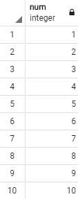

## SELECT

### 기본 구문

```sql
[ WITH [ RECURSIVE ] with_query [, ...] ]
SELECT [ ALL | DISTINCT [ ON ( expression [, ...] ) ] ]
    [ * | expression [ [ AS ] output_name ] [, ...] ]
    [ FROM from_item [, ...] ]
    [ WHERE condition ]
    [ GROUP BY grouping_element [, ...] ]
    [ HAVING condition [, ...] ]
    [ WINDOW window_name AS ( window_definition ) [, ...] ]
    [ { UNION | INTERSECT | EXCEPT } [ ALL | DISTINCT ] select ]
    [ ORDER BY expression [ ASC | DESC | USING operator ] [ NULLS { FIRST | LAST } ] [, ...] ]
    [ LIMIT { count | ALL } ]
    [ OFFSET start [ ROW | ROWS ] ]
    [ FETCH { FIRST | NEXT } [ count ] { ROW | ROWS } ONLY ]
    [ FOR { UPDATE | NO KEY UPDATE | SHARE | KEY SHARE } [ OF table_name [, ...] ] [ NOWAIT | SKIP LOCKED ] [...] ]
```

<br/>

### 동작 순서

1. `WITH` 목록에 정의된 요소들이 계산됩니다. 여기서 계산된 결과는 `FROM`절에서 사용할 수 있으며, `NOT MATERIALIZED`를 사용하지 않는 이상 `FROM`에서 2번 이상 사용되더라도 계산은 한번만 이루어집니다.

<br/>

2. `FROM` 목록에 정의된 요소들이 계산됩니다. 두 개 이상의 요소가 주어진 경우 `corss-join` 됩니다.

<br/>

3. 만약 `WHERE`절이 사용되었다면, 주어진 조건을 만족하지 않는 행은 결과집합에서 제외됩니다.

<br/>

4. 만약 `GROUP BY`절 또는 `집계함수`가 사용되었다면, 결과집합을 그룹화한 뒤에 집계함수의 결과를 계산합니다. 만약 `HAVING`절이 사용되었다면, 주어진 조건을 만족하지 않는 그룹은 결과집합에서 제외됩니다.

<br/>

5. `SELECT`절에 주어진 `행` 또는 `그룹`의 목록을 사용하여 실제 결과집합을 계산합니다.

<br/>

6. `SELECT DISTINCT`는 결과집합에서 중복된 행을 제거합니다. `SELECT ALL(default)`는 중복된 행도 포함하여 반환합니다.

<br/>

7. 집합 연산자 (`UNION`, `INTERSECT`, `EXCEPT`)를 계산합니다. `ALL`를 사용하지 않는 이상 결과집합에서 중복된 행은 제거됩니다.

<br/>

8. `ORDER BY`가 사용되었다면 해당 순서로 결과집합을 정렬합니다. 사용되지 않았다면 빨리 찾아낸 순서대로 반환됩니다.

<br/>

9. `LIMIT`(=`FETCH FIRST`) 또는 `OFFSET`이 사용되었다면, 결과집합에서 해당 부분집합만 반환합니다.

<br/>

10. `FOR UPDATE`, `FOR NO KEY UPDATE` 또는 `FOR KEY SHARE`이 사용되었다면 결과집합에 포함된 행에 대해 `LOCK`을 겁니다.

<br/>

### `WITH` Clause

`WITH`절은 서브쿼리를 가상의 뷰로 만들어 `FROM`절에 제공할 수 있도록 도와줍니다. 각 서브쿼리는 `SELECT`, `TABLE`, `VALUES`, `INSERT`, `UPDATE`, `DELETE` 중 하나가 올 수 있으며, 만약 부작용을 동반하는 문장(`INSERT`, `UPDATE`, `DELETE`)이라면 `RETURNING`절의 결과를 사용합니다. `RETURNING`절을 사용되지 않아도 에러를 발생시키지는 않지만, `FROM`절에서 해당 뷰를 참조할 수 없게 됩니다.

<br/>

`WITH RECURSIVE` 형태로 사용된다면 뷰가 자기 자신을 참조하는 것을 허용합니다. 이 경우 재귀참조는 아래처럼 `UNION [ALL | DISTINCT]`의 우측에 존재해야 합니다.

```sql
WITH RECURSIVE
test AS (
    NON-RECURSIVE-SELECT
    UNION [ALL | DISTINCT]
    RECURSIVE-SELECT
)
...
```

```sql
WITH RECURSIVE
test AS (
    SELECT 1 AS num
    UNION ALL
    SELECT num+1 FROM test WHERE num < 10
)
SELECT * FROM test;
```



```sql
CREATE TABLE test (
    child int,
    parent int NULL
);
INSERT INTO test VALUES (1, 5), (2, 5), (3, 5), (5, 10), (10, 15), (15, null);

WITH RECURSIVE
temp AS (
	-- first node.
    SELECT
		test.child,
		test.parent,
		1 AS depth,
		test.child::text AS path
	FROM test
	WHERE test.child = 1

	UNION ALL

	-- next node.
	SELECT
		test.child,
		test.parent,
		depth + 1,
		path || ' → ' || test.child
	FROM test, temp
	WHERE temp.parent = test.child
)
SELECT * FROM temp;
```


<br/>

`RECURSIVE`는 단 한번만 사용되어야 하며, 재귀를 사용하는 모든 뷰에 적용됩니다. 단, 재귀를 사용하지 않는 뷰에 대해서는 적용되지 않습니다.

```sql
WITH RECURSIVE
test1 AS (
    SELECT 1 AS num1
    UNION ALL
    SELECT num1+1 FROM test1 WHERE num1 < 1000
),
test2 AS (
    SELECT 1 AS num2
    UNION ALL
    SELECT num2+1 FROM test2 WHERE num2 < 1000
)
SELECT * FROM test1, test2 WHERE num1 = num2;
```

<br/>

자신보다 이전에 선언된 형제만 참조할 수 있습니다.

```sql
WITH
test1 AS (
    SELECT * FROM test2 -- ERROR
),
test2 AS (
    SELECT 1 AS x
)
SELECT * FROM test1;
```

<br/>

`PRIMARY QUERY`와 `WITH QUERY`는 동일한 시간값을 가지고 실행되므로 `WITH`에서 데이터를 수정해도 `RETUNING`을 제외한 다른 방법으로 변경된 데이터를 감지하는 것은 불가능합니다. 따라서 아래처럼 두 서브쿼리가 동일한 행을 수정하려고 하면 예측할 수 없는 결과가 만들어집니다.

```sql
CREATE TABLE test (
    val int
);
INSERT INTO test VALUES (0);

WITH
m1 AS (
    UPDATE test SET val = 1 WHERE val = 0
),
m2 AS (
    UPDATE test SET val = 2 WHERE val = 0
)
SELECT * FROM test;
```

<br/>

`WITH`에 사용된 서브쿼리는 여러번 참조되어도 한 번만 계산되도록 제한되어 있기 때문에 별도의 실행계획을 사용하지만, `NOT MATERIALIZED`가 함께 사용하면 이러한 제한을 제거할 수 있으며, 주 쿼리와 서브 쿼리를 풀어내어 계산하므로 더 좋은 실행계획을 찾을 가능성이 높아집니다. 그러나 이것은 휘발성이 존재하는 쿼리인 경우에만 작동하고, 휘발성이 아닌 쿼리(`재귀적`이거나 `부작용이 없는` 쿼리)라고 판단되면 `NOT MATERIALIZED`는 무시됩니다.

<br/>

### `FROM` Clause

```sql
where from_item can be one of:

    [ ONLY ] table_name [ * ] [ [ AS ] alias [ ( column_alias [, ...] ) ] ]
                [ TABLESAMPLE sampling_method ( argument [, ...] ) [ REPEATABLE ( seed ) ] ]
    [ LATERAL ] ( select ) [ AS ] alias [ ( column_alias [, ...] ) ]
    with_query_name [ [ AS ] alias [ ( column_alias [, ...] ) ] ]
    [ LATERAL ] function_name ( [ argument [, ...] ] )
                [ WITH ORDINALITY ] [ [ AS ] alias [ ( column_alias [, ...] ) ] ]
    [ LATERAL ] function_name ( [ argument [, ...] ] ) [ AS ] alias ( column_definition [, ...] )
    [ LATERAL ] function_name ( [ argument [, ...] ] ) AS ( column_definition [, ...] )
    [ LATERAL ] ROWS FROM( function_name ( [ argument [, ...] ] ) [ AS ( column_definition [, ...] ) ] [, ...] )
                [ WITH ORDINALITY ] [ [ AS ] alias [ ( column_alias [, ...] ) ] ]
    from_item [ NATURAL ] join_type from_item [ ON join_condition | USING ( join_column [, ...] ) ]
```

`FROM`절은 해당 쿼리에서 사용할 데이터 소스의 목록을 지정하는 역할을 합니다. 만약 여러개의 소스가 지정되었다면, 모든 소스를 카테시안 곱셈(`CROSS-JOIN`)한 결과를 반환합니다. 이 때, `WHERE`절을 명시적으로 추가하여 카테시안 곱셈의 작은 부분집합을 가져올 수 있습니다.

<br/>

데이터 소스는 다음 중 하나를 허용합니다.

-   테이블
-   서브쿼리
-   `WITH`절에 선언된 쿼리
-   함수호출

<br/>

데이터 소스로 `테이블`을 사용할 수 있습니다. 만약 `ONLY`를 테이블 이름의 앞에 사용했다면, 해당 테이블만 스캔 되도독(=자식 테이블이 스캔되지 않도록) 지정할 수 있습니다. 만약 `*`를 테이블 이름의 뒤에 사용했다면, 명시적으로 모든 자식 테이블을 데이터 소스로 지정할 수 있습니다.

```sql
-- X의 자식 테이블은 제외.
FROM ONLY X;

-- X의 모든 자식 테이블도 포함.
FROM X;
FROM X*;
```

<br/>

데이터 소스로 `서브쿼리`를 사용할 수 있습니다. 이 경우, 해당 서브쿼리는 `Temporary Table`로 구체화되어 쿼리에서 사용됩니다. 각각의 서브쿼리는 반드시 괄호로 감싸야하며 `alias`도 함께 주어져야 합니다. `VALUES ...` 또한 서브쿼리로 사용할 수 있습니다.

```sql
SELECT *
FROM ( SELECT 1 AS x, 2 AS y ) AS TEST;

-- 또는
SELECT *
FROM ( SELECT 1, 2 ) AS TEST(x, y);

-- 또는
SELECT *
FROM ( VALUES (1, 2) ) AS TEST(x, y);

-- Multiple Values
SELECT *
FROM ( VALUES (1, 2), (3, 4), ... ) AS TEST(x, y);
```

<br/>

데이터 소스로 `WITH절에 선언된 쿼리`를 사용할 수 있습니다. 만약 `WITH-QUERY`의 이름과 중복되는 테이블이 있다면 `WITH-QUERY`가 우선적으로 사용됩니다. 즉, 기존 테이블의 이름은 가려집니다.

```sql
-- 테이블 생성
CREATE TABLE TEST (
    x int
);
INSERT INTO TEST VALUES (1), (2), (3);

-- 기존 테이블의 이름과 겹치도록 WITH 쿼리를 생성
WITH TEST AS (
    SELECT * FROM ( VALUES (4), (5), (6) ) AS TEST(y)
)
SELECT * FROM TEST;
```


<br/>

데이터 소스로 `함수호출`을 사용할 수 있습니다. 일반적으로는 모든 함수를 사용할 수 있지만, 보편적으로는 집합을 반환하는 함수가 사용됩니다. `WITH ORDINALITY`가 함께 사용되면, 마지막 컬럼에 `bigint`형식의 데이터 순번이 부여됩니다.

```sql
SELECT *
FROM   unnest( array['x', 'y', 'z'] ) AS test(token);
```


```sql
SELECT *
FROM   unnest(array['x', 'y', 'z']) WITH ORDINALITY AS test(token, seq);
```


<br/>

기본적으로 `FROM`에서 `Right-Hand Element`는 `Left-Hand Element`의 데이터를 읽을 수 없습니다. 그러나 `SUB-SELECT` 또는 `FUNCTION-CALL`의 앞에 `LATERAL` 키워드를 함께 사용하면, 해당 요소의 좌측에서 선언된 데이터를 읽을 수 있습니다.

```sql
-- 샘플 데이터 테이블
CREATE TABLE test (
	x int,
	y int
);
INSERT INTO test VALUES (1, 1), (1, 2), (1, 3), (2, 1),  (2, 5), (2, 6);
```

먼저 잘못된 쿼리부터 살펴보겠습니다. 우측 인라인뷰에서 `(test.)x`와 `(test.)y`를 읽으려고 했지만, 기본적으로 좌측의 테이블의 데이터를 읽을 수 없으므로 에러가 발생합니다.

```sql
SELECT *
FROM   test, ( SELECT x + y ) as sub("x+y");

[output]
ERROR:  column "x" does not exist
There is a column named "x" in table "test", but it cannot be referenced from this part of the query.
```

하지만 `LATERAL` 키워드를 함께 사용하면 좌측의 `test`의 컬럼을 읽을 수 있습니다.

```sql
SELECT *
FROM   test, LATERAL ( SELECT x + y ) as sub("x+y");
```


이것을 `JOIN`과 함께 사용하면 `상호 연관 서브쿼리`와 결과가 같아집니다. 예를 들어, 각 `x`마다 그룹을 지어 `y`가 평균보다 큰 행만 출력하는 작업을 `상호 연관 서브쿼리`로 작성해보면 다음과 같습니다.

```sql
SELECT *
FROM   test t1
WHERE  y > (
    SELECT avg(t2.y)
    FROM   test t2
    WHERE  t2.x = t1.x
);
```


위의 쿼리가 동작하는 방식은 다음과 같습니다.

1. `메인쿼리`에서 `t1.x`를 읽을 때 마다 `서브쿼리`에 전달합니다.
2. `서브쿼리`에서 `t1.x`에 해당하는 `t2.y`를 읽어 평균을 구하고 반환합니다.
3. `WHERE`절에서 평균보다 큰 행만 가져옵니다.

`메인쿼리`에서 참조되는 데이터가 읽힐 때 마다 `서브쿼리`에 삽입되어 호출됩니다. 호출된 횟수는 실행계획의 `LOOP` 항목을 통해 확인할 수 있습니다.


<br/>

이것과 동일한 결과를 반환하는 쿼리를 `LATERAL JOIN`으로도 작성할 수 있습니다.

```sql
SELECT t1.*
FROM   test as t1 JOIN LATERAL (
    SELECT avg(t2.y)
    FROM   test as t2
    WHERE  t2.x = t1.x
) as sub
ON    t1.y > avg;
-- OR
WHERE t1.y > avg;
```

위의 쿼리가 동작하는 방식은 다음과 같습니다.

1. `좌측`에서 `t1.x`를 읽을 때 마다 `우측`에 전달합니다.
2. `우측`에서 `t1.x`에 해당하는 `t2.y`를 읽어 평균을 구합니다.
3. `ON`절 또는 `WHERE`절에서 평균보다 큰 행만 가져옵니다.

`좌측쿼리`에서 참조되는 데이터가 읽힐 때 마다 `우측쿼리(=LATERAL Query)`에 삽입되어 호출됩니다. 호출된 횟수는 실행계획의 `LOOP` 항목을 통해 확인할 수 있습니다.


<br/>

`LATERAL`은 함수호출의 앞에 사용할 수 있지만, 이 경우에는 `Noise Word`입니다. 있으나 없으나 `LATERAL`로 간주되기 때문입니다.

```sql
SELECT  temp2.*
FROM   (VALUES (array[1, 2, 3], array[4, 5, 6])) as temp1(x, y),
       unnest(x, y) as temp2(a, b); -- Implicit LATERAL
```


<br/>

### `WHERE` Clause

```sql
WHERE boolean_expression
```

주어진 표현식이 `true`인 행만 결과집합에 포함시킵니다.

<br/>

`boolean`을 반환하는 연산자는 다음이 있습니다.

**동등 및 대소비교:**

-   `=`
-   `>`
-   `<`
-   `>=`
-   `<=`
-   `<>` or `!=`
-   `BETWEEN a AND b` : 주어진 숫자가 `a`이상 `b`이하라면 `true`.

```sql
SELECT 1 = 1; -- true
SELECT 2 != 2 -- false
SELECT 1 BETWEEN 1 AND 3; -- true
SELECT 3 BETWEEN 1 AND 3; -- true
```

<br/>

**논리 연산자 :**

-   `NOT`
-   `AND`
-   `OR`

```sql
SELECT true AND true; -- true
SELECT true OR false; -- true
SELECT NOT false; -- true
```

<br/>

**LIKE 표현식 :**

-   `str LIKE exp` : `str`이 `exp`에 일치하면 `true`를 반환합니다.

`LIKE`에 사용할 수 있는 특수기호는 다음과 같습니다.

| 기호 | 의미                    |
| :--: | ----------------------- |
|  \_  | 임의의 한 글자에 매칭   |
|  %   | 임의의 여러 글자에 매칭 |

```sql
SELECT 'Hello, World!' LIKE 'H_'; -- false
SELECT 'Hello, World!' LIKE 'H%'; -- true
SELECT 'Hello, World!' LIKE '%W%'; -- true
```

<br/>

**SMILAR TO 정규 표현식 :**

-   `str SIMILAR TO exp`
-   `str NOT SIMILAR TO exp`

`SIMILAR TO`에 사용할 수 있는 특수기호는 다음과 같습니다.

|  기호  | 의미                                          |
| :----: | --------------------------------------------- |
|   \|   | 대체자. a 또는 b                              |
|   \*   | 앞의 아이템이 0개 이상인 경우에 매칭          |
|   +    | 앞의 아이템이 1개 이상인 경우에 매칭          |
|  {m}   | 앞의 아이템이 m개인 경우에 매칭               |
|  {m,}  | 앞의 아이템이 m개 이상인 경우에 매칭          |
| {m, n} | 앞의 아이템이 m개 이상 n개 이하인 경우에 매칭 |
|   ()   | 여러 아이템을 하나의 아이템으로 묶음          |
| [...]  | 문자열을 각 문자로 쪼갬                       |

```sql
SELECT 'Hello, World!' SIMILAR TO '[a-zA-Z]*'; -- false
SELECT 'Hello, Hello!' SIMILAR TO '(Hello(,|!) ){2}'; -- true
```

<br/>

**POSIX 정규 표현식 :**

-   `str ~ pattern` : 대소문자를 `엄격히` 비교하여 `str`이 `pattern`에 일치하면 `true`.
-   `str ~* pattern`: 대소문자를 `느슨하게` 비교하여 `str`이 `pattern`에 일치하면 `true`.
-   `str !~ pattern` : 대소문자를 `엄격히` 비교하여 `str`이 `pattern`에 일치하지 않으면 `true`.
-   `str !~* pattern` : 대소문자를 `느슨하게` 비교하여 `str`이 `pattern`에 일치하지 않으면 `true`.

```sql
SELECT 'Hello, World!' ~ '^H.*!$'; -- true;
```

자세한 사항은 공식문서의 [POSIX-REGEXP](https://www.postgresql.org/docs/12/functions-matching.html#FUNCTIONS-POSIX-REGEXP)를 참조해주세요.

<br/>

**포함 및 미포함 :**

-   `IN` : 주어진 항목이 리스트에 있다면 `true`.
-   `NOT IN` : 주어진 항목에 리스트에 없다면 `true`.
-   `EXISTS` : 주어진 서브쿼리가 공집합이 아니라면 `true`.
-   `NOT EXISTS` : 주어진 서브쿼리가 공집합이 이라면 `true`.

```sql
-- Single Column.
SELECT 1 IN (1, 2, 3); -- true

-- Multi Column.
SELECT (1, 2) NOT IN ((1, 2), (3, 4), (5, 6)); -- false
```

```sql
SELECT EXISTS ( SELECT 1 ); -- true;

SELECT NOT EXISTS ( SELECT 1 WHERE false ); -- true;
```

<br/>

### `GROUP BY` Clause

```sql
GROUP BY grouping_element [, ...]
```

`GROUP BY`절은 하나 이상의 컬럼을 그룹으로 묶어 `동일한 그룹 값`을 갖는 여러 데이터들을 `집계 함수`를 통해 하나의 행으로 압축하는 역할을 수행합니다. 아래는 각 `(학년, 반)`의 평균 키를 구하는 예제입니다.


\*\* `GROUP BY`절이 적용되었다면 결과행은 개수는 `그룹의 개수`보다 커질 수 없습니다.

**테스트 데이터 :**

```sql
CREATE TABLE students (
    grade int,
    class int,
    name text,
    sex text,
    height int
);
INSERT INTO students VALUES
    (1, 1, 'grace', 'f', 164),
    (1, 1, 'erica', 'f', 174),
    (1, 2, 'caden', 'm', 182),
    (2, 1, 'lucas', 'm', 177),
    (2, 1, 'irene', 'f', 167);
```

**각 (학년, 반) 마다 평균키 계산 :**

```sql
SELECT grade, class, avg(height) as "avg_height"
FROM   students
GROUP BY (grade, class);
```

<br/>

#### SELECT 인덱스 사용

`GROUP BY`는 `SELECT`에서 사용된 순서대로 1부터 번호를 매기고 있기 때문에, 위의 쿼리는 다음처럼 바꿔 사용할 수 있습니다.

```sql
SELECT grade, class, avg(height) as "avg_height"
FROM   students
GROUP BY (1, 2);
```

<br/>

#### 컬럼 이름 규칙

컬럼의 이름에 `입력 컬럼이름`과 `결과 컬럼이름`을 둘 다 사용할 수 있지만, 둘의 이름이 겹친경우 `입력 컬럼이름`을 우선적으로 사용합니다. 먼저 `결과 컬럼이름`을 사용할 수 있다는 것 부터 확인하겠습니다. 다음 쿼리는 정상적으로 실행됩니다.

```sql
SELECT grade as "g", class as "c", avg(height) as "avg_height"
FROM   students
GROUP BY (g, c);
```

이번에는 일부러 `class`의 이름만 `grade`로 바꿔보았습니다. 다음 쿼리는 에러가 발생할 것 같지만 `입력 컬럼이름을 우선적으로 사용한다`는 규칙에 의해 정상적으로 실행됩니다.

```sql
SELECT grade, class as "grade", avg(height) as "avg_height"
FROM   students
GROUP BY (grade, class);
```

<br/>

#### 정보 손실 규칙

그룹화에 사용되지 않은 데이터는 `집계함수 없이 사용할 수 없습니다`. 즉, 다음 쿼리는 실행되지 않습니다.

```sql
SELECT grade, class, height
FROM   students
GROUP BY (grade, class);
```

<br/>

#### 컬럼 결합 규칙

`GROUPING SETS`, `CUBE` 또는 `ROLL UP`을 사용하지 않은 다중 그룹은, 단일 그룹으로 결합됩니다. 즉, 아래의 쿼리는 모두 동일한 동작을 수행합니다.

```sql
GROUP BY (grade, class, sex);

-- OR
GROUP BY (grade), (class), (sex);

-- OR
GROUP BY (grade, class), (sex);

-- OR
GROUP BY (grade), (class, (sex);

-- OR
GROUP BY grade, class, sex;
```

<br/>

#### 다차원 분석

`GROUPING SETS`, `CUBE` 또는 `ROLL UP`을 사용하면 `여러 각도`에서 좀 더 복잡한 그룹화를 수행할 수 있습니다. 이것을 `다차원 분석`이라고 합니다.

<br/>

`GROUPING SETS`는 각각의 그룹화 표현식을 사용하여 쿼리를 실행하고 각각의 결과를 결합합니다. 예를 들어, 다음 쿼리는 `(grade)`, `(class)`, `(sex)`에 대해 쿼리를 수행한 뒤 결과를 결합합니다. 이 때, 그룹화에 사용되지 않은 컬럼은 `null`로 출력됩니다.

```sql
SELECT grade, class, sex, avg(height) as "avg_height"
FROM   students
GROUP BY GROUPING SETS ((grade), (class), (sex));
```


만약 비어있는 컬럼집합을 사용한다면, 모든 데이터가 집계 함수로 넘어갑니다. 아무 컬럼도 사용되지 않아 `(null, null)`로 출력되었을 겁니다. 즉, 아래 사진에서 `172.8`이 전체 학생의 평균키입니다.

```sql
SELECT grade, class, avg(height) as "avg_height"
FROM   students
GROUP BY GROUPING SETS ((grade), (class), ());
```


비어있는 컬럼집합을 통해 알 수 있듯이, `다차원 분석`에 넘겨진 그룹의 컬럼이 일치하지 않아도 괜찮습니다.

```sql
SELECT grade, class, sex, avg(height) as "avg_height"
FROM   students
GROUP BY GROUPING SETS ((grade, sex), (class), ());
```


<br/>

`ROLLUP`은 각각의 그룹화 표현식 리스트를 뒤에서부터 하나씩 제거하면서(`말아 올라가면서`), 쿼리를 수행하고 각각의 결과를 결합합니다. `ROLLUP`을 `GROUPING SETS`로 표현하면 다음과 같습니다.

```sql
ROLLUP(a, b, c, ...)

GROUPING SETS (
    (a, b, c, ...),
    ...,
    (a, b, c),
    (a, b),
    (a),
    ()
)
```

예를 들어, 다음 쿼리는 `(grade, class, sex)`부터 시작하여 `(grade, class)`, `(grade)`, `()`까지 집계함수를 실행합니다.

```sql
SELECT grade, class, sex, avg(height) as "avg_height"
FROM   students
GROUP BY ROLLUP(grade, class, sex);
-- OR
GROUP BY ROLLUP((grade), (class), (sex));
```


당연하지만, 이번에도 각각의 표현식에 사용된 컬럼의 개수는 일치하지 않아도 괜찮습니다. 이번에는 `((grade, class), (sex))`부터 시작하여 `((grade, class))`, `()`까지 집계함수를 실행합니다.

```sql
SELECT grade, class, sex, avg(height) as "avg_height"
FROM   students
GROUP BY ROLLUP((grade, class), (sex));
```


<br/>

`CUBE`는 각각의 그룹화 표현식 리스트에서 `가능한 모든 조합`을 생성해낸 뒤, 집계함수를 실행하고 각각의 결과를 결합합니다. `CUBE`을 `GROUPING SETS`로 표현하면 다음과 같습니다.

```sql
CUBE (a, b, c);
-- OR
CUBE ((a), (b), (c));

GROUPING SETS (
    ( a, b, c ),
    ( a, b    ), -- (a, b)
    ( a,    c ), -- (a, c)
    ( a       ), -- (a)
    (    b, c ), -- (b, c)
    (    b    ), -- (b)
    (       c ), -- (c)
    (         )  -- ( )
)
```

마찬가지로, 각각의 표현식에 사용된 컬럼의 개수가 동일하지 않아도 괜찮습니다. 아래의 쿼리는 다음 조합을 생성하여 집계함수에 넘깁니다.

-   `((grade, class), (sex))`
-   `((grade, class))`
-   `((sex))`
-   `()`

```sql
SELECT grade, class, sex, avg(height) as "avg_height"
FROM   students
GROUP BY CUBE((grade, class), (sex));
```


<br/>

#### 암묵적 그룹화

`GROUP BY`를 사용하지 않고 `집계 함수`를 사용할 수 있습니다. 이 경우 `비어있는 그룹화 표현식`을 사용한 것으로 간주됩니다.

```sql
SELECT avg(height) as "avg_height"
FROM   students
-- GROUP BY ()
```

이 때, 다른 컬럼을 이용하려고 하면 `데이터 손실 규칙`를 위반하므로 에러가 발생합니다.

```sql
SELECT grade, class, avg(height) as "avg_height"
FROM   students
-- GROUP BY ()
```

<br/>

#### 자주 사용되는 집계함수

-   `avg(exp)` : `null`이 아닌 값을 평균냄
-   `sum(exp)` : `null`이 아닌 값을 합계냄
-   `min(exp)` : `null`이 아닌 최소값을 찾아냄
-   `max(exp)` : `null`이 아닌 최대값을 찾아냄
-   `count(exp)` : `null`이 아닌 값의 개수를 반환함
-   `count(*)` : 모든 행의 개수를 반환함

더 많은 집계함수는 [여기](https://www.postgresql.org/docs/12/functions-aggregate.html)에서 확인할 수 있습니다.

<br/>

#### 반드시 알아야 하는 집계함수 성능 향상법

위에서 보듯이 `null`이 아닌 값을 알아서 거르기 때문에, 각 컬럼마다 `null이면 0으로 치환`할 필요가 전혀 없으며, 불필요한 계산으로 인해 성능을 감소시키는 좋지 않은 패턴입니다. 단, `대상이 아무것도 없는 경우`에는 집계함수 자체가 `null`을 반환하기 때문에, 겉에서는 치환해야 합니다.

```sql
avg(COALESCE(height, 0)); -- SO BAD.
COALESCE(avg(height), 0); -- GOOD!
```

<br/>

### `HAVING` Clause

```sql
HAVING condition
```

`GROUP BY`을 수행하고 조건을 만족하지 않는 그룹을 결과에서 제거합니다. 기본적은 사항은 `WHERE`과 같으나 `집계함수`를 사용할 수 있다는 점이 다릅니다. 먼저 필터링하기 전의 쿼리와 그 결과부터 보고 시작하겠습니다.

```sql
SELECT grade, class, avg(height) as "avg_height"
FROM   students
GROUP BY (grade, class);
```


클래스가 `1반`이고, 평균키가 `170`이상인 그룹만 남도록 필터링하면...

```sql
SELECT grade, class, avg(height) as "avg_height"
FROM   students
GROUP BY (grade, class)
HAVING class = 1 AND 170 <= avg(height);
```


<br/>

#### `WHERE`절에서 먼저 필터링하자

`1반`이 아닌 반은 어차피 거를 것 임에도 불구하고, `집계함수`의 대상으로 포함되었기 때문에 불필요한 계산이 발생했다고 볼 수 있습니다. `WHERE`절이 먼저 실행되므로 다음 쿼리가 더 좋은 판단입니다.

```sql
SELECT grade, class, avg(height) as "avg_height"
FROM   students
WHERE  class = 1
GROUP BY (grade, class)
HAVING 170 <= avg(height);
```

하지만 최신의 데이터베이스는 `집계함수가 사용되지 않은 조건절`을 `WHERE`로 옮기도록 최적화하기 때문에 어떤 쿼리를 사용해도 괜찮긴 하지만, 왜 성능이 향상되는지는 알아두는 편이 좋습니다.

<br/>

### `WINDOW` Clause

#### 문법

```sql
[ WINDOW window_name AS ( window_definition ) [, ...] ]
```

여러번 재사용되는 윈도우 구간을 정의합니다. 이 절을 이해하기 위해서는 먼저 `윈도우 함수`부터 알아야 합니다.

<br/>

#### 윈도우 함수 문법

```sql
function_name ([expression [, expression ... ]]) [ FILTER ( WHERE filter_clause ) ] OVER window_name
function_name ([expression [, expression ... ]]) [ FILTER ( WHERE filter_clause ) ] OVER ( window_definition )
function_name ( * ) [ FILTER ( WHERE filter_clause ) ] OVER window_name
function_name ( * ) [ FILTER ( WHERE filter_clause ) ] OVER ( window_definition )
```

`window_definition` :

```sql
[ existing_window_name ]
[ PARTITION BY expression [, ...] ]
[ ORDER BY expression [ ASC | DESC | USING operator ] [ NULLS { FIRST | LAST } ] [, ...] ]
[ frame_clause ]
```

`frame_clause` is one of :

```sql
{ RANGE | ROWS | GROUPS } frame_start [ frame_exclusion ]
{ RANGE | ROWS | GROUPS } BETWEEN frame_start AND frame_end [ frame_exclusion ]
```

`frame_start`, `frame_end` is one of :

```sql
UNBOUNDED PRECEDING
offset PRECEDING
CURRENT ROW
offset FOLLOWING
UNBOUNDED FOLLOWING
```

`frame_exclusion` is one of :

```sql
EXCLUDE CURRENT ROW
EXCLUDE GROUP
EXCLUDE TIES
EXCLUDE NO OTHERS
```

<br/>

#### 집계함수와 차이점

`윈도우 함수`는 `집계 함수`와 유사하지만 다중 행을 단일 행으로 압축하지는 않습니다.


하지만 윈도우 함수와 집계 함수는 거의 동일하기 때문에, `OVER ...`구문을 사용해야 윈도우 함수로 동작합니다. `OVER...`구문이 사용되지 않은 경우에는 집계 함수로 동작합니다.

```sql
-- sum은 집계 함수
SELECT sum(salary) FROM empsalary;

-- sum은 윈도우 함수
SELECT sum(salary) OVER () FROM empsalary;
```

<br/>

#### 매커니즘

윈도우 함수는 `파티션`과 `프레임`이라는 특별한 개념을 사용하는데, 간단하게 설명하면 다음과 같습니다.

-   프레임 : `행`의 집합
-   파티션 : `프레임`의 집합
-   테이블 : `파티션`의 집합


각 행은 `자신이 속한 프레임의 식별자`를 가지고 있고, 윈도우 함수는 `최상위 프레임`에서 시작해서 `각 프레임 구간`에 윈도우 함수를 적용합니다.

<br/>

`프레임 구간`은 꽤 중요한 용어입니다. `연속된 1개 이상의 프레임`이 동시에 윈도우 함수에 전달될 수 있다는 것을 의미하기 때문입니다. `PostgreSQL`이 기본적으로 사용하는 파티션 구간은 다음과 같습니다.

-   `프레임 시작점` : 각 파티션의 첫 번째 프레임
-   `프레임 종료점` : 현재 가르키고 있는 프레임

<br/>

위의 기본값이 의미하는 것은 `같은 파티션에서는 프레임이 누적된다`는 것이며, 어떤 파티션이 `[x, y, z]`라는 프레임으로 나눠져 있다면, 각각 `[x]`, `[x, y]`, `[x, y, z]`를 타겟으로 하는 윈도우 함수가 차례대로 호출된다는 것입니다.

<br/>

#### PARTITION BY

`OVER (PARTITION BY ...)` 구문을 사용하여 테이블을 파티션으로 나눌 수 있습니다. 먼저 예제 데이터를 생성합니다.

```sql
CREATE TABLE empsalary (
    depname text,
    empno int,
    salary int
);

INSERT INTO empsalary VALUES
    ('develop', 11, 5200),
    ('develop', 7, 4200),
    ('develop', 9, 4500),
    ('develop', 8, 6000),
    ('develop', 10, 5200),
    ('personnel', 5, 3500),
    ('personnel', 2, 3900),
    ('sales', 3, 4800),
    ('sales', 1, 5000),
    ('sales', 4, 4800);
```

`depname`을 기준으로 파티션을 나누고, 각 파티션의 평균 임금을 구해보겠습니다. 윈도우 함수는 `프레임`에만 적용된다는 것을 생각하면 의아할 수 있으나, `ORDER BY`가 생략되면 각 파티션이 하나의 프레임으로 간주되기 때문에 괜찮습니다.

```sql
SELECT depname, empno, salary, avg(salary) OVER (PARTITION BY depname) FROM empsalary;
```

| depname   | empno | salary | avg                   |
| --------- | ----- | ------ | --------------------- |
| develop   | 11    | 5200   | 5020.0000000000000000 |
| develop   | 7     | 4200   | 5020.0000000000000000 |
| develop   | 9     | 4500   | 5020.0000000000000000 |
| develop   | 8     | 6000   | 5020.0000000000000000 |
| develop   | 10    | 5200   | 5020.0000000000000000 |
| personnel | 5     | 3500   | 3700.0000000000000000 |
| personnel | 2     | 3900   | 3700.0000000000000000 |
| sales     | 3     | 4800   | 4866.6666666666666667 |
| sales     | 1     | 5000   | 4866.6666666666666667 |
| sales     | 4     | 4800   | 4866.6666666666666667 |

<br/>

`PARTITION BY`를 지정하지 않았다면 테이블이 하나의 파티션이 됩니다.

```sql
SELECT depname, empno, salary, avg(salary) OVER () FROM empsalary;
```

| depname   | empno | salary | avg                   |
| --------- | ----- | ------ | --------------------- |
| develop   | 11    | 5200   | 4710.0000000000000000 |
| develop   | 7     | 4200   | 4710.0000000000000000 |
| develop   | 9     | 4500   | 4710.0000000000000000 |
| develop   | 8     | 6000   | 4710.0000000000000000 |
| develop   | 10    | 5200   | 4710.0000000000000000 |
| personnel | 5     | 3500   | 4710.0000000000000000 |
| personnel | 2     | 3900   | 4710.0000000000000000 |
| sales     | 3     | 4800   | 4710.0000000000000000 |
| sales     | 1     | 5000   | 4710.0000000000000000 |
| sales     | 4     | 4800   | 4710.0000000000000000 |

<br/>

`PARTITION BY`는 다중 컬럼도 허용합니다.

```sql
SELECT depname, empno, salary, sum(salary) OVER (PARTITION BY (depname, empno)) FROM empsalary;
```

| depname   | empno | salary | sum  |
| --------- | ----- | ------ | ---- |
| develop   | 7     | 4200   | 4200 |
| develop   | 8     | 6000   | 6000 |
| develop   | 9     | 4500   | 4500 |
| develop   | 10    | 5200   | 5200 |
| develop   | 11    | 5200   | 5200 |
| personnel | 2     | 3900   | 3900 |
| personnel | 5     | 3500   | 3500 |
| sales     | 1     | 5000   | 5000 |
| sales     | 3     | 4800   | 4800 |
| sales     | 4     | 4800   | 4800 |

<br/>

#### ORDER BY

`ORDER BY`를 사용하여 현재 파티션을 프레임으로 나누어 정렬할 수 있습니다. 함께 기술된 `정렬 조건`에서 최상위에 위치한 프레임부터 윈도우 함수가 적용됩니다.

```sql
SELECT depname, empno, salary, sum(salary) OVER (ORDER BY depname) FROM empsalary;
```

| depname   | empno | salary | sum   |
| --------- | ----- | ------ | ----- |
| develop   | 11    | 5200   | 25100 |
| develop   | 7     | 4200   | 25100 |
| develop   | 9     | 4500   | 25100 |
| develop   | 8     | 6000   | 25100 |
| develop   | 10    | 5200   | 25100 |
| personnel | 5     | 3500   | 32500 |
| personnel | 2     | 3900   | 32500 |
| sales     | 3     | 4800   | 47100 |
| sales     | 1     | 5000   | 47100 |
| sales     | 4     | 4800   | 47100 |

위의 쿼리는 다음 순서대로 동작합니다.

1. `PARTITION BY`가 선언되지 않았으므로 테이블이 하나의 파티션이 됩니다.
2. `ORDER BY`가 선언되었으므로 파티션이 `depname`으로 3개의 프레임으로 나뉩니다.
3. 정렬 요구조건에 따라 `develop`, `personnel`, `sales`에 `sum()`을 적용합니다.
   프레임 구간 옵션은 기본값(`동일 파티션 내, 프레임 누적`)이 사용됩니다.

<br/>

결과를 의사코드로 재구성해보면 다음과 같습니다.

-   `25100` : sum( `develop` )
-   `32500` : sum( `develop`, `personnel` )
-   `47100` : sum( `develop`, `personnel`, `sales` )

<br/>

#### 프레임 구간

윈도우 함수에는 `연속적인 1개 이상의 프레임`을 동시에 넘길 수 있습니다. 이 때, 프레임 구간을 설정하려면 `시작점`과 `종료점`이 주어져야 하죠. 이 지점을 넘기는 방식은 `BETWEEN`의 사용여부에 따라 2가지로 나뉩니다.


`BETWEEN`을 함께 사용하려면, 아래의 쿼리처럼 `srt`와 `end`가 함께 주어져야 합니다. 이 경우에는 `[srt, end]`가 프레임 구간이 됩니다.

```sql
OVER ( ... BETWEEN srt AND end)
```

<br/>

`BETWEEN`을 사용하지 않으려면 `point`를 하나만 주어도 괜찮습니다. 이 경우에는 `point`가 `CURRENT ROW`보다 작다면 `srt`로 간주되고, 그렇지 않다면 `end`로 간주됩니다. 물론 반대편은 `CURRENT ROW`가 됩니다.

```sql
OVER ( ... p)
```

<br/>

포인트는 다음과 같이 주어질 수 있습니다.

-   `UNBOUNDED PRECEDING` : 해당 파티션의 첫 행.
-   `UNBOUNDED FOLLOWING` : 해당 파티션의 마지막 행.
-   `n PRECEDING` : 현재 행에서 `n`칸 전의 행 또는 프레임.
-   `n FOLLOWING` : 현재 행에서 `n`칸 후의 행 또는 프레임.
-   `CURRENT ROW` : 현재 프레임의 마지막 행 또는 프레임.

<br/>

윈도우 함수는 `프레임`을 기준으로 삼는다고 했는데, 뜬금없이 `행`에 관련된 얘기가 튀어나왔습니다. 이 의문에 대한 대답은 다음 절인 `프레임 구간 모드`에서 자세히 다룹니다.

<br/>

#### 프레임 구간 모드

사실 프레임 구간의 각 지점은 `프레임` 단위 뿐만이 아니라 `행` 단위로도 지정할 수 있습니다. 어떤 단위로 시작점을 정의할 것 인지 `프레임 구간 모드`를 명시적으로 적어서 설정할 수 있습니다.

<br/>

현재 사용할 수 있는 프레임 구간 모드(`mode`)는 다음 3가지가 있습니다.

-   `ROWS` : 행 단위 이동. 프레임 보정 없음.
-   `RANGE` : 행 단위 이동. 단, 가장 가까운 프레임으로 이동.
-   `GROUPS` : 프레임 단위 이동.

<br/>

먼저 예제를 생성해보겠습니다.

```sql
CREATE TABLE numbers (
    n int
);

INSERT INTO numbers VALUES
    (0),
    (0),
    (1),
    (5),
    (8),
    (8),
    (14),
    (14),
    (14),
    (22);
```

그리고 동일한 숫자끼리 같은 프레임으로 묶은 뒤, 프레임 구간을 조절해가면서 합계를 구해보겠습니다.

```sql
SELECT n, sum(n) OVER (ORDER BY n ...) FROM numbers;
```

<br/>

먼저 각 모드들은 `CURRENT ROW`에 대한 개념부터 다릅니다. `ROWS`는 `현재 행`만 가르키지만, `RANGE`는 `현재 프레임의 마지막 행`, `GROUPS`는 `현재 프레임`을 가르킵니다.


<br/>

다음으로 `n PRECEDING/FOLLOWING`의 이동방식이 다릅니다. `ROWS`는 `카운트 행 단위`, `GROUPS`는 `카운트 프레임 단위`로 이동하지만 `RANGE`는 `오프셋 값 단위`로 이동합니다.

<br/>

`RANGE`에 대해 자세히 설명하면 `3 PRECEDING`은 현재 프레임의 값인 8에서 3이전의 값인 5를 찾는다는 뜻입니다. 이 때, 값이 완벽하게 일치하는 것이 없다면, 그것보다 큰 값을 갖는 프레임을 선택합니다.


<br/>

이러한 이유로 `RANGE` 모드에서 `1 PRECEDING`과 `2 PRECEDING`은 현재 프레임을 벗어나지 못합니다.


<br/>

#### Exclude

앞서 정의된 프레임 구간에서, 특정 행이나 프레임을 제외시킬 수 있습니다. 가능한 옵션은 다음과 같습니다.

<br/>

-   `EXCLUDE CURRENT ROW`

현재 행만 제외합니다. `GROUPS` 또는 `RANGE` 모드로 작동하더라도, 그 프레임의 1개 행만 제외합니다. 같은 프레임의 다른 데이터는 살아남습니다.

<br/>

`EXCLUDE GROUP`

현재 프레임의 데이터 전체를 제외합니다. `ROWS` 모드로 작동하더라도 다중 행이 제외될 수 있습니다.

<br/>

`EXCLUDE TIES`

프레임 데이터를 묶어서 1개로만 취급합니다. 프레임에 여러 행이 있더라도 1개 행만 전달됩니다.

<br/>

`EXCLUDE NO OTHERS` (default)

아무것도 제외하지 않습니다.

<br/>

#### Named window

같은 윈도우가 여러번 사용되는 경우, `SELECT`의 부속절인 `WINDOW`절에서 미리 선언할 수 있습니다.

```sql
SELECT salary, sum(salary) over (my_window)
FROM empsalary
WINDOW my_window AS (ORDER BY salary);
```

<br/>

#### 자주 사용되는 함수

-   `ROW_NUMBER()`

각 파티션의 최상위 행부터 출발하여 1부터 번호를 매깁니다. 등수를 매기는데에도 사용될 수 있습니다.

<br/>

-   `RANK()`

각 파티션의 최상위 행부터 출발하여 1부터 번호를 매깁니다. 중복된 값에는 같은 번호를 매기지만, 각 번호가 연속적이지 않을 수 있습니다.

<br/>

-   `DENSE_RANK()`

각 파티션의 최상위 행부터 출발하여 1부터 번호를 매깁니다. 중복된 값에는 같은 번호를 매기며, `RANK()`와 다르게 연속적으로 번호를 부여합니다.


<br/>

-   `NTILE(n)`

각 파티션에 데이터를 `n`개의 버킷에 최대한 공평하게 분배하고, 버킷의 번호를 반환합니다. 분배 규칙은 다음과 같습니다.

1. `x`개를 `n`으로 나눈 몫과 나머지를 구한다. (`11 / 4 = Q(2) + R(3)`)
2. 각 버킷에 몫을 더한다. bucket_size = [`2`, `2`, `2`, `2`]
3. 나머지를 앞선 버킷부터 더한다. bucket_size = [`2+1`, `2+1`, `2+1`, `2`]


<br/>

### `UNION`, `INTERSECT`, `EXCEPT` Clause

```sql
select ...
{UNION | INTERSECT | EXCEPT} [ALL | EXCEPT]
select ...
```

집합 연산자는 `호환 가능한 두 SELECT`의 `합집합`, `교집합`, `차집합`을 계산합니다. 여기서 `호환 가능하다`라는 의미는 다음 조건을 의미합니다.

-   컬럼의 개수가 같다.
-   각 컬럼의 타입이 같다.

컬럼의 이름은 일치하지 않아도 괜찮습니만, 좌측에서 사용된 컬럼의 이름을 우선적으로 사용합니다. 현재는 `ORDER BY`와 `WITH LOCKING`구문이 없어야만 사용할 수 있습니다.

<br/>

`UNION`은 두 집합의 합집합을 계산합니다. `EXCEPT(default)`가 사용되면 중복된 행을 제거합니다. `ALL`이 사용되면 중복된 행을 제거하지 않습니다.

<br/>

`INTERSECT`는 두 집합의 교집합을 계산합니다. `EXCEPT(default)`가 사용되면 중복된 행을 제거합니다. `ALL`이 사용되면 중복된 행이 `min(좌측중복개수, 우측중복개수)` 만큼 출력됩니다.

<br/>

`EXCEPT`는 왼쪽 집합에서 오른쪽 집합을 뺀 차집합을 계산합니다. `EXCEPT(default)`가 사용되면 중복된 행을 제거합니다. `ALL`이 사용되면 중복된 행이 `min(좌측중복개수 - 우측중복개수, 0)` 만큼 출력됩니다.

<br/>

### `ORDER BY`

```sql
ORDER BY expression [ ASC | DESC | USING operator ] [ NULLS { FIRST | LAST } ] [, ...]
```

결과 집합을 주어진 정렬조건을 사용하여 정렬하며, 표현식에 `컬럼` 또는 `계산식`을 사용할 수 있습니다. 컬럼에는 `컬럼이름` 또는 `좌측에서부터 부여된 서수번호`를 사용하여 지정할 수 있습니다.

```sql
SELECT val FROM data ORDER BY val;
SELECT val FROM data ORDER BY 1;
SELECT val FROM data ORDER BY val * val;
```

<br/>

컬럼의 이름을 사용하는 경우 `입력 컬럼이름`과 `결과 컬럼이름`을 둘 다 사용할 수 있지만, 둘의 이름이 겹친경우 `출력 컬럼이름`을 우선적으로 사용합니다.

```sql
CREATE TABLE data (
    k int,
    v int
);

INSERT INTO data VALUES
    (2, 1),
    (1, 3),
    (3, 2);

SELECT
    k as g,
    v as k
FROM data ORDER BY k;
```

| g   | k   |
| --- | --- |
| 2   | 1   |
| 3   | 2   |
| 1   | 3   |

<br/>

정렬에 사용된 컬럼이 `SELECT-List`에 포함되지 않아도 됩니다.

```sql
SELECT k FROM data ORDER BY v;
```

<br/>

### `OFFSET`, `LIMIT` Clause

```sql
[OFFSET srt]
[LIMIT {cnt | ALL}]
```

결과 집합에서 첫 `srt`개를 무시하고, 다음에 만나는 `cnt`개를 반환합니다. `ALL(default)`인 경우 행의 끝까지 반환합니다.


