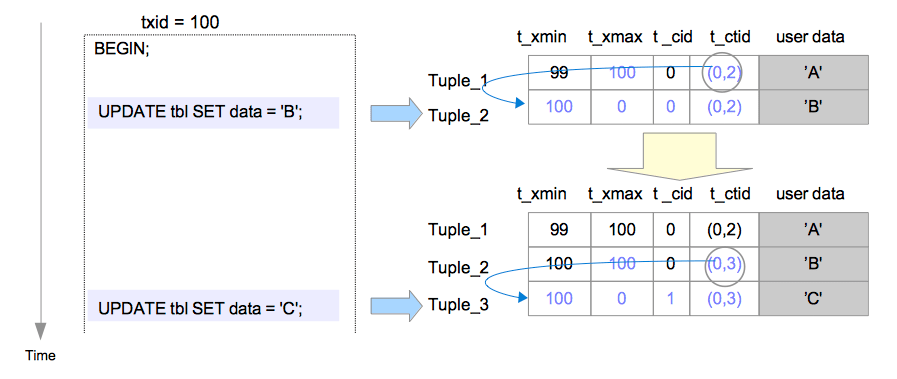
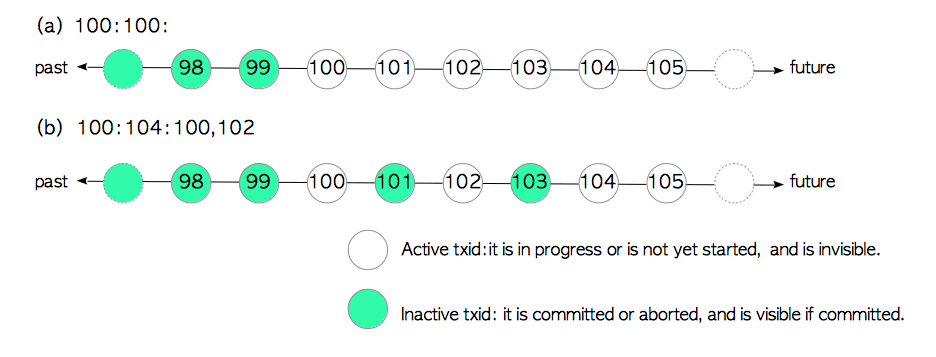

## MVCC

### 개요

`PostgreSQL`은 내부적으로 다중 버전 동시성 제어(`MVCC`, `Multi Version Concurrency Control`) 모델을 사용하여 동시성을 제어합니다. 위키피디아가 하나의 문서마다 여러개의 버전을 가지고 있듯이, `PostgreSQL`은 각 행마다 여러개의 버전을 허용합니다.

<br/>

`MVCC`모델은 하나의 테이블에 대한 `READ`, `WRITE` 동시 작업을 `LOCK`없이 수행할 수 있도록 도와주어, 데이터베이스 전체 성능을 향상시킵니다.

<br/>

### 트랜잭션 아이디

트랜잭션(=`BEGIN`)이 시작되면 해당 트랜잭션에는 특별한 식별자가 부여됩니다. 이것을 `트랜잭션 아이디(XID)`라고 하는데, 해당 트랜잭션이 커밋되면 튜플에 `XID`를 함께 저장하기 때문에, 어떤 행이 언제 수정되었는지 `XID`를 통해 알아낼 수 있습니다. `MVCC`는 `XID`를 사용하여 자신보다 과거에 수행되었고 커밋된 트랜잭션의 결과만 확인할 수 있도록 강제하는 매커니즘입니다.

<br/>

트랜잭션 아이디는 `unsigned int32` 타입의 정수이며, 타입의 최대값에 도달하면 3부터 재활용합니다. `0, 1, 2`부터 시작하지 않는 이유는 `특별한 상태`를 표시하는 값이기 때문이고. 재활용이 발생하면 자신보다 값이 커도 과거일 수 있기 때문에, 환형으로 그렸을 때 자신보다 `2^31`개 앞에있는 아이디는 `Future`로, 자신보다 `2^31`개 뒤에있는 아이디는 `Past`로 간주됩니다.

-   `TID 0` : 유효하지 않은 트랜잭션. (존재하지 않는 트랜잭션.)
-   `TID 1` : 부트스트랩 트랜잭션.
-   `TID 2` : 동결된 트랜잭션.


<br/>

### 데이터는 항상 덧붙여진다

수정이 발생하더라도 이전 버전은 바로 삭제되지 않습니다. 아직 해당 버전을 사용중인 트랜잭션이 존재할 수 있기 때문입니다. 따라서 `PostgreSQL`은 수정이 발생해도 이전 버전을 삭제하지 않고 `삭제 표시`만 해둔 뒤에, 최신 버전을 파일의 뒤에 덧붙입니다. 이러한 방식 때문에, 파일의 크기는 항상 증가하는 방향으로 흘러갑니다.


<br/>

다만 오라클은 이것과는 다른 방식으로 `MVCC`를 구현하는데, 해당 포스팅에서는 이에 대해 설명하지 않겠습니다.

<br/>

### 튜플 헤더의 구조

각 튜플의 헤더는 `MVCC`를 구현하기 위한 4가지 컬럼이 정의되어 있습니다.


-   `t_xmin` : 이 버전을 생성한 트랜잭션의 아이디. (생성 시각)
-   `t_xmax` : 이 버전을 삭제한 트랜잭션의 아이디. (만료 시각)
-   `t_cid` : 이 버전을 생성한 트랜잭션에서, 몇 번째 쿼리가 이 버전을 생성했는지 가르킨다. (0부터 시작.)
-   `t_ctid` : 다음 버전의 `(페이지번호, 컬럼번호)`가 기록되어 있다. 현재 버전이 최신인 경우 자기 자신을 가르킨다.

<br/>

### MVCC 예제

#### 튜플 삽입

`XID=99`인 트랜잭션이 새로운 데이터를 삽입했다면, 현재 페이지의 가장 뒤에 덧붙여집니다.


**Tuple_1 :**

|  column  | desc                                                    |
| :------: | ------------------------------------------------------- |
| `t_xmin` | 해당 버전을 생성한 트랜잭션의 아이디인 99가 저장됩니다. |
| `t_xmax` | 해당 버전을 삭제한 트랜잭션이 없으므로 0이 저장됩니다.  |
| `t_cid`  | 해당 버전은 트랜잭션의 0번째 쿼리가 생성했습니다.       |
| `t_ctid` | 해당 버전이 최신이므로 자기 자신을 가르킵니다.          |

<br/>

#### 튜플 삭제

`XID=111`인 트랜잭션이 데이터를 삭제했다면, 실제 페이지에서는 지워지지 않고 논리적으로만 지워집니다.


**Tuple_1 :**

|  column  | desc                                                     |
| :------: | -------------------------------------------------------- |
| `t_xmin` |                                                          |
| `t_xmax` | 해당 버전을 삭제한 트랜잭션의 아이디인 111이 저장됩니다. |
| `t_cid`  |                                                          |
| `t_ctid` |                                                          |

이제 `XID=111`보다 미래의 트랜잭션이 이 테이블을 조회하면 `Tuple_1`은 조회되지 않습니다.

<br/>

#### 튜플 갱신

`XID=100`인 트랜잭션이 데이터를 갱신하면, 이전의 데이터는 유지한 채, 새로운 데이터를 페이지의 가장 뒷부분에 덧붙입니다.



<br/>

```sql
UPDATE tbl SET data = 'B';
```

**Tuple_1 :**

|  column  | desc                                                     |
| :------: | -------------------------------------------------------- |
| `t_xmin` |                                                          |
| `t_xmax` | 다음 버전을 생성한 트랜잭션의 아이디인 100이 저장됩니다. |
| `t_cid`  |                                                          |
| `t_ctid` | 다음 버전을 가르킵니다.                                  |

**Tuple_2 :**

|  column  | desc                                                     |
| :------: | -------------------------------------------------------- |
| `t_xmin` | 해당 버전을 생성한 트랜잭션의 아이디인 100이 저장됩니다. |
| `t_xmax` | 해당 버전을 삭제한 트랜잭션이 없으므로 0이 저장됩니다.   |
| `t_cid`  | 해당 버전은 트랜잭션의 0번째 쿼리가 생성했습니다.        |
| `t_ctid` | 현재 버전을 가르킵니다.                                  |

<br/>

```sql
UPDATE tbl SET data = 'C';
```

**Tuple_2 :**

|  column  | desc                                                     |
| :------: | -------------------------------------------------------- |
| `t_xmin` |                                                          |
| `t_xmax` | 다음 버전을 생성한 트랜잭션의 아이디인 100이 저장됩니다. |
| `t_cid`  |                                                          |
| `t_ctid` | 다음 버전을 가르킵니다.                                  |

**Tuple_3 :**

|  column  | desc                                                     |
| :------: | -------------------------------------------------------- |
| `t_xmin` | 해당 버전을 생성한 트랜잭션의 아이디인 100이 저장됩니다. |
| `t_xmax` | 해당 버전을 삭제한 트랜잭션이 없으므로 0이 저장됩니다.   |
| `t_cid`  | 해당 버전은 트랜잭션의 1번째 쿼리가 생성했습니다.        |
| `t_ctid` | 현재 버전을 가르킵니다.                                  |

<br/>

### 트랜잭션 스냅샷

트랜잭션 스냅샷이란 `활동중인 트랜잭션의 아이디`를 모아놓은 데이터 집합입니다. 현재 트랜잭션 스냅샷은 다음 쿼리를 통해 확인할 수 있습니다.

```sql
SELECT txid_current_snapshot();
```

<br/>

트랜잭션 스냅샷은 2~3개의 요소가 콜론을 통해 구분됩니다.

```text
lower:upper:[between [, ...]]
```

-   `xid < lower`이라면 `inactive`입니다.
-   `uppder <= xid`이라면 `active`입니다.
-   `xid in between_list`이라면 `active`입니다.

<br/>



<br/>

트랜잭션 스냅샷은 `Transaction Manager`에 의해 관리되며, 트랜잭션이 시작될 때 마다 포함되고, 트랜잭션이 커밋되거나 중단될 때 마다 제외됩니다.


<br/>

### 동결 상태

어떤 행이 매우 오랫동안 수정되지 않아 `Future`로 취급되는 문제를 `Transaction Wraparound Problem`이라고 합니다. 예를 들어, 어떤 행이 `XID=100`에 의해 삽입되었다고 가정하겠습니다. 즉, `t_xmin=100`인 상태입니다. 시간이 매우 오랫동안 흐르고 `XID=2^31 +100 +1`에 도달한 경우에, 이제 `XID=100`은 미래로 간주되므로 튜플을 삭제하지는 않았지만 `invisible`로 취급되어 데이터가 보이지 않게됩니다.


`PostgreSQL`은 이러한 문제를 해결하기 위해, 오랫동안 수정되지 않은 튜플은 `FREEZE`로 표기하여 어떠한 상황에서든 `visible`로 취급하는 매커니즘을 도입했습니다. 즉, `XID=2`인 트랜잭션은 어떠한 상황에서든 `inactive, visible`로 간주됩니다.

<br/>

이러한 동결 프로세스는 `Vaccum Process`에 의해 실행되며, `vacuum_freeze_min_age(default 50 million)`동안 건드린적이 없는 튜플은 `FREEZE`상태로 변경됩니다. 동결 상태를 표현하는 방법은 버전에 따라 다른데, 과거 버전은 `t_xmin=2`으로 수정하는 방식을 사용하고, 최신 버전은 `t_infomask`에 동결상태를 가르키는 마스크를 씌웁니다.


<br/>

### 참고 문헌

-   https://www.postgresql.org/docs/12
-   http://www.interdb.jp/pg/pgsql05.html

---

## Transaction Isolation Level

### 격리성 수준과 락의 강도

트랜잭션이 데이터 작업을 수행하기 위해서는 `Lock`을 획득하는 작업이 먼저 수행되어야 합니다. 하지만 트랜잭션이 하나만 있는것은 아니죠. 여러개의 트랜잭션이 하나의 테이블에 동시에 접근할 때 `Lock`에 의한 충돌이 발생할 수 있습니다.

<br/>

하지만 무턱대고 `Lock`의 강도를 낮추면 동시성은 증가하지만 의도하지 않은 현상, 즉 이상현상(`Anomaly`)이 발생할 가능성이 큽니다. 그렇다고 `Lock`의 강도를 높이면 이상현상은 줄어들겠지만, 경합이 발생할 가능성이 더욱 늘어나기 때문에 동시성은 감소하겠죠.

<br/>

상황에 따라 적절한 `Trade-Off`가 필요하며, 트랜잭션 격리성 레벨이 바로 `Lock`의 강도를 조절하는 역할을 수행합니다. 트랜잭션 격리성 레벨의 종류는 다음과 같습니다. 하위 레벨은 상위 레벨을 포함합니다.

| level                      | desc                                                                                              |
| :------------------------- | ------------------------------------------------------------------------------------------------- |
| `Read uncommitted`         | 커밋하지 않은 데이터도 읽거나 수정할 수 있음.                                                     |
| `Read committed` (default) | 커밋된 데이터만 읽거나 수정할 수 있음.                                                            |
| `Repeatable read`          | 동시에 어떤 테이블이 변경(`INSERT` or `UPDATE` or `DELETE`)되는 것을 방지.                        |
| `Serializable`             | 동시에 어떤 테이블이 변경&조회((`INSERT` or `UPDATE` or `DELETE`) and (`SELECT`)) 되는 것을 방지. |

<br/>

트랜잭션 레벨을 조절하려면, `BEGIN` 이후에 다음 쿼리를 수행해야 합니다.

```sql
SET TRANSACTION ISOLATION LEVEL { SERIALIZABLE | REPEATABLE READ | READ COMMITTED | READ UNCOMMITTED }
```

<br/>

### 이상현상

잠금의 강도가 낮아 의도치 않은 결과가 발생하는 것을 `Anomaly`라고 합니다. 이상현상의 종류는 다음과 같습니다.

| anomaly                 | desc                                                         |
| :---------------------- | ------------------------------------------------------------ |
| `Dirty Read`            | 커밋되지 않은 데이터가 보임.                                 |
| `Nonrepeatable Read`    | 연속으로 테이블을 읽었는데 서로 결과가 다름.                 |
| `Phantom Read`          | 연속으로 테이블을 읽었는데 없었던 행이 추가됨.               |
| `Serialization Anomaly` | 같은 상황에서 동일한 트랜잭션 그룹의 수행결과가 매번 달라짐. |

※ 하위에 있을수록 특별한 케이스의 이상현상이며, 상위에 있는 이상현상은 하위의 이상현상을 포함합니다.

<br/>

각 격리성 레벨로 해결할 수 있는 이상현상은 다음과 같습니다.

| Isolation Level    |    `Dirty Read`     | `Nonrepeatable Read` |   `Phantom Read`    | `Serialization Anomaly` |
| :----------------- | :-----------------: | :------------------: | :-----------------: | :---------------------: |
| `Read uncommitted` | 가능, PG에서는 불가 |         가능         |        가능         |          가능           |
| `Read committed`   |       불가능        |         가능         |        가능         |          가능           |
| `Repeatable read`  |       불가능        |        불가능        | 가능, PG에서는 불가 |          가능           |
| `Serializable`     |       불가능        |        불가능        |       불가능        |         불가능          |

<br/>

#### Dirty Read

커밋되지 않은 튜플이 보이는 현상입니다. 다만 `PostgreSQL`은 모든 격리성 레벨에서 `inactive` 트랜잭션의 변경점을 볼 수 없기 때문에, 어떠한 격리성 레벨에서든 `Dirty Read`가 발생하지 않습니다.

※ 표준에서는 `READ COMMITTED` 이상을 사용해야 해결되도록 명시하고 있습니다.

<br/>

아래는 `PostgreSQL`이 `Dirty Read`를 허용한다고 가정했을 경우의 시나리오입니다.

```sql
CREATE TABLE Point2D (
    x int,
    y int
);
```

| tx1                                                                                      | tx2                                                 |
| ---------------------------------------------------------------------------------------- | --------------------------------------------------- |
| `BEGIN;`                                                                                 |                                                     |
| `SET TRANSACTION ISOLATION LEVEL READ UNCOMMITTED;`                                      |                                                     |
|                                                                                          | `BEGIN;`                                            |
|                                                                                          | `SET TRANSACTION ISOLATION LEVEL READ UNCOMMITTED;` |
| `SELECT * FROM Point2D;` <br/> x ㅣ y <br/> -------- <br/> 0 rows affected.              |                                                     |
|                                                                                          | `INSERT INTO Point2D VALUES (0, 0);`                |
| `SELECT * FROM Point2D;` <br/> x ㅣ y <br/> -------- <br/> 0 ㅣ 0 <br/> 1 rows affected. |                                                     |
|                                                                                          | `ROLLBACK;`                                         |
| `SELECT * FROM Point2D;` <br/> x ㅣ y <br/> -------- <br/> 0 rows affected.              |                                                     |
| `COMMIT;`                                                                                |

<br/>

#### Nonrepeatable Read

테이블을 연속으로 읽었는데, `내용이 변경된 행`이 발견되는 현상입니다. 두 번의 조회 중간에 다른 트랜잭션이 데이터를 변경했을 때 발생합니다. `READ COMMITTED`이하의 격리성 레벨은 자신보다 이후에 일어난 `inactive` 트랜잭션의 변경점도 읽기 때문에 발생합니다. `REPEATABLE READ` 이상의 격리성 레벨을 사용하면, `테이블의 동시 갱신`을 방지하므로 해결할 수 있습니다.

※ 다른 데이터베이스는 행에 락을 거는 방식으로 구현합니다.

```sql
CREATE TABLE Point2D (
    x int,
    y int
);

INSERT INTO Point2D VALUES (0, 0);
```

| tx1                                                                                      | tx2                                               |
| ---------------------------------------------------------------------------------------- | ------------------------------------------------- |
| `BEGIN;`                                                                                 |                                                   |
| `SET TRANSACTION ISOLATION LEVEL READ COMMITTED;`                                        |                                                   |
|                                                                                          | `BEGIN;`                                          |
|                                                                                          | `SET TRANSACTION ISOLATION LEVEL READ COMMITTED;` |
| `SELECT * FROM Point2D;` <br/> x ㅣ y <br/> -------- <br/> 0 ㅣ 0 <br/> 1 rows affected. |                                                   |
|                                                                                          | `UPDATE Point2D SET (x, y) = (1, 1);`             |
|                                                                                          | `COMMIT;`                                         |
| `SELECT * FROM Point2D;` <br/> x ㅣ y <br/> -------- <br/> 1 ㅣ 1 <br/> 1 rows affected. |                                                   |
| `COMMIT;`                                                                                |

<br/>

#### Phantom Read

테이블을 연속으로 읽었는데, `새롭게 추가된 행`이 발견되는 현상입니다. 두 번의 조회 중간에 다른 트랜잭션이 데이터를 삽입했을 때 발생합니다. `READ COMMITTED`이하의 격리성 레벨은 자신보다 이후에 일어난 `inactive` 트랜잭션의 변경점도 읽기 때문에 발생합니다. `REPEATABLE READ` 이상의 격리성 레벨을 사용하면, 자신보다 이후에 일어난 `inactive` 트랜잭션을 읽지 않으므로 해결할 수 있습니다.

※ 다른 데이터베이스는 테이블에 락을 거는 방식으로 구현합니다.

※ 표준에서는 `SERIALIZABLE`를 사용해야 해결되도록 명시하고 있습니다.

<br/>

```sql
CREATE TABLE Point2D (
    x int,
    y int
);
```

| tx1                                                                                      | tx2                                               |
| ---------------------------------------------------------------------------------------- | ------------------------------------------------- |
| `BEGIN;`                                                                                 |                                                   |
| `SET TRANSACTION ISOLATION LEVEL READ COMMITTED;`                                        |                                                   |
|                                                                                          | `BEGIN;`                                          |
|                                                                                          | `SET TRANSACTION ISOLATION LEVEL READ COMMITTED;` |
| `SELECT * FROM Point2D;` <br/> x ㅣ y <br/> -------- <br/> 0 rows affected.              |                                                   |
|                                                                                          | `INSERT INTO Point2D VALUES (0, 0);`              |
|                                                                                          | `COMMIT;`                                         |
| `SELECT * FROM Point2D;` <br/> x ㅣ y <br/> -------- <br/> 0 ㅣ 0 <br/> 1 rows affected. |                                                   |
| `COMMIT;`                                                                                |                                                   |

<br/>

#### Write-Write Confilct

`REPEATABLE READ` 이상의 격리성 수준은 `테이블의 동시 갱신(UPDATE)`을 배제합니다.

<br/>

두 개의 쓰기 트랜잭션이 같은 행을 동시에 수정하는 상황을 가정해보면, 더 빨리 `UPDATE`문에 도달한 트랜잭션은 `테이블에 대한 배타적 락`을 성공적으로 획득하고, 뒤늦게 `UPDATE`문에 도달한 트랜잭션은 `테이블에 대한 배타적 락`을 얻으려고 시도하지만, 첫 번째 트랜잭션이 얻은 락과 충돌이 발생하므로 선행 트랜잭션이 `COMMIT` 또는 `ROLLBACK`을 날려서 락이 해제될 때 까지 대기합니다. (이것은 모든 격리성 레벨에서 적용됩니다.)

<br/>

이 때, 선행 트랜잭션이 `ROLLBACK`을 날린다면 후행 트랜잭션의 `UPDATE`문은 성공하지만, 선행 트랜잭션이 `COMMIT`을 날린다면 후행 트랜잭션은 실패하게 됩니다. 후행 트랜잭션이 갱신하고자 하는 튜플이 더 이상 유효하지 않기 때문입니다.

```sql
CREATE TABLE Point2D (
    x int,
    y int
);

INSERT INTO Point2D VALUES (0, 0);
```

| tx1                                                | tx2                                                |
| -------------------------------------------------- | -------------------------------------------------- |
| `BEGIN;`                                           |                                                    |
| `SET TRANSACTION ISOLATION LEVEL REPEATABLE READ;` |                                                    |
|                                                    | `BEGIN;`                                           |
|                                                    | `SET TRANSACTION ISOLATION LEVEL REPEATABLE READ;` |
| `UPDATE Point2D SET (x, y) = (1, 1);`              |                                                    |
|                                                    | `UPDATE Point2D SET (x, y) = (2, 2);` -- 대기      |
| `COMMIT;`                                          |                                                    |
|                                                    | `UPDATE Point2D SET (x, y) = (2, 2);` -- 에러      |

```text
ERROR:  could not serialize access due to concurrent update

오류:  동시 업데이트 때문에 순차적 액세스가 불가능합니다.
```

해당 에러가 발생하면, 실패한 트랜잭션을 처음부터 다시 시도해야 합니다.

<br/>

반면 선행 트랜잭션이 `ROLLBACK`을 날리면, 후행 트랜잭션이 갱신하고자 하는 튜플이 여전히 유효하므로 에러가 발생하지 않습니다.

| tx1                                                | tx2                                                |
| -------------------------------------------------- | -------------------------------------------------- |
| `BEGIN;`                                           |                                                    |
| `SET TRANSACTION ISOLATION LEVEL REPEATABLE READ;` |                                                    |
|                                                    | `BEGIN;`                                           |
|                                                    | `SET TRANSACTION ISOLATION LEVEL REPEATABLE READ;` |
| `UPDATE Point2D SET (x, y) = (1, 1);`              |                                                    |
|                                                    | `UPDATE Point2D SET (x, y) = (2, 2);` -- 대기      |
| `ROLLBACK;`                                        |                                                    |
|                                                    | `UPDATE Point2D SET (x, y) = (2, 2);` -- 성공      |
|                                                    | `COMMIT;`                                          |

<br/>

격리성 수준이 `READ COMMITTED` 이하인 경우 `COMMIT`을 날려도 에러가 발생하지 않습니다. 해당 격리성 수준에서는 `Nonrepeatable Read`가 발생하므로, 후행 트랜잭션이 선행 트랜잭션의 변경점을 볼 수 있기 때문입니다. 다만, 후행 트랜잭션이 선행 트랜잭션의 결과를 덮어쓰는 `Lost Update`현상이 발생할 수 있습니다.

| tx1                                                | tx2                                                |
| -------------------------------------------------- | -------------------------------------------------- |
| `BEGIN;`                                           |                                                    |
| `SET TRANSACTION ISOLATION LEVEL REPEATABLE READ;` |                                                    |
|                                                    | `BEGIN;`                                           |
|                                                    | `SET TRANSACTION ISOLATION LEVEL REPEATABLE READ;` |
| `UPDATE Point2D SET (x, y) = (1, 1);`              |                                                    |
|                                                    | `UPDATE Point2D SET (x, y) = (2, 2);` -- 대기      |
| `COMMIT;`                                          |                                                    |
|                                                    | `UPDATE Point2D SET (x, y) = (2, 2);` -- 성공      |
|                                                    | `COMMIT;`                                          |

`tx2`가 `tx1`의 내용을 덮었기 때문에, 최종 결과는 다음과 같습니다.

| x   | y   |
| --- | --- |
| 2   | 2   |

<br/>

#### Serialization Anomaly

선행 트랜잭션의 진행 중에 다른 트랜잭션이 끼어드는 바람에, 선행 트랜잭션이 일부 튜플을 누락한 현상을 `직렬화 이상`이라고 합니다. 시나리오를 가정해보겠습니다. 아래의 순서도에서 각각의 `SELECT COUNT(*) FROM Point2D;` 은 어떤 값을 출력할까요? 초기 테이블은 비어있다고 가정합니다.

```sql
CREATE TABLE Point2D (
    x int,
    y int
);
```

| tx1                                                | tx2                                                |
| -------------------------------------------------- | -------------------------------------------------- |
| `BEGIN;`                                           |                                                    |
| `SET TRANSACTION ISOLATION LEVEL REPEATABLE READ;` |                                                    |
| `INSERT INTO Point2D VALUES (1, 1);`               |                                                    |
|                                                    | `BEGIN;`                                           |
|                                                    | `SET TRANSACTION ISOLATION LEVEL REPEATABLE READ;` |
|                                                    | `INSERT INTO Point2D VALUES (2, 2);`               |
|                                                    | `SELECT COUNT(*) FROM Point2D;` -- 1               |
|                                                    | `COMMIT;`                                          |
| `SELECT COUNT(*) FROM Point2D;` -- 1               |                                                    |
| `COMMIT;`                                          |                                                    |

<br/>

`tx1` 관점에서 살펴보겠습니다. `REPETABLE READ` 레벨에서는 후행 트랜잭션의 결과가 보이지 않기 때문에 1을 출력하겠지만, `SELECT`가 실행되기 전에 후행 트랜잭션이 `(2, 2)`을 삽입하고 커밋까지 해버린 것을 눈여겨봐야 합니다. 정말로 결과가 1이 맞는걸까요? `SELECT`가 실행된 시점에서는 데이터베이스에 2개의 튜플이 존재하고 있을텐데 말이죠. 모든 트랜잭션이 끝나고 다시 `SELECT COUNT(*) FROM Point2D;`를 날리면 2가 나올 것임이 명백합니다.

<br/>

위와 같은 이상현상은 `동일 테이블에 읽기와 쓰기를 시도`하려는 트랜잭션이 2개 이상 있을 경우에 발견됩니다. `SERIALIZABLE`은 위와같은 직렬화 이상을 감지하면, 선착순 하나만 커밋을 허용하고, 나머지는 커밋을 거부합니다. 이것은 N개의 경쟁자 중 오직 하나만 `읽기/쓰기`가 허락된다고 볼 수 있습니다. `SERIALIZABLE`이 커밋을 거부하면, 실패한 트랜잭션을 처음부터 다시 시도해야 하며, 이것을 성공할 때 까지 반복해야 합니다.

```text
ERROR:  could not serialize access due to read/write dependencies among transactions

오류:  트랜잭션간 읽기/쓰기 의존성 때문에 serialize 접근을 할 수 없음
상세정보:  Reason code: Canceled on identification as a pivot, during commit attempt.
힌트:  재시도하면 그 트랜잭션이 성공할 것입니다.
```

<br/>

---

## Lock

### 테이블 락

테이블을 조회하거나 정의를 변경하는 경우에 `테이블에 대한 락`을 먼저 획득해야 합니다. 배타 락은 하나의 트랜잭션만이 소유할 수 있으며, 공유 락은 여러개의 트랜잭션이 동시에 소유할 수 있습니다.

<br/>

`PostgreSQL`에서 지원하는 테이블 락은 다음과 같습니다. 이름에 `ROW`가 들어있더라도 테이블 락입니다.

<br/>

#### `ACCESS SHARE`

**충돌 :**

-   `ACCESS EXCLUSIVE`

가장 너그러운 락입니다. 가장 강력한 락인 `ACCESS EXCLUSIVE`을 제외한 모든 락과 호환됩니다. 테이블을 읽고 수정하지 않는 명령어(`SELECT`)가 해당 락을 요구합니다.

<br/>

#### `ROW SHARE`

**충돌 :**

-   `EXCLUSIVE`
-   `ACCESS EXCLUSIVE`

명시적인 `SELECT FOR UPDATE` 또는 `SELECT FOR SHARE` 명령어로만 획득할 수 있습니다.

<br/>

#### `ROW EXCLUSIVE`

**충돌 :**

-   `SHARE`
-   `SHARE ROW EXCLUSIVE`
-   `EXCLUSIVE`
-   `ACCESS EXCLUSIVE`

테이블의 데이터를 수정하거나 삽입하기 위해 필요합니다. `UPDATE`, `DELETE`, `INSERT`와 같이 테이블의 데이터를 수정하는 명령어가 해당 락을 요구합니다. `INSERT`의 경우에 외부키가 설정되어 있다면, 외부 테이블에 대한 `ACCESS SHARE`락도 함께 요구합니다. 여러 트랜잭션이 하나의 테이블의 서로다른 범위를 수정할 수 있으므로, 자기 자신과는 충돌하지 않습니다.

<br/>

#### `SHARE UPDATE EXCLUSIVE`

**충돌 :**

-   `SHARE UPDATE EXCLUSIVE`
-   `SHARE`
-   `SHARE ROW EXCLUSIVE`
-   `EXCLUSIVE`
-   `ACCESS EXCLUSIVE`

테이블의 스키마를 변경하기 위해 필요합니다. 다음 명령어들이 해당 락을 요구합니다.

-   `VACUUM WITHOUT FULL`
-   `ANALYZE`
-   `CREATE INDEX CONCURRENTLY`
-   `REINDEX CONCURRENTLY`
-   `CREATE STATISTICS`
-   일부 `ALTER INDEX`
-   일부 `ALTER TABLE`

<br/>

#### `SHARE`

**충돌 :**

-   `ROW EXCLUSIVE`
-   `SHARE UPDATE EXCLUSIVE`
-   `SHARE ROW EXCLUSIVE`
-   `EXCLUSIVE`
-   `ACCESS EXCLUSIVE`

테이블의 데이터가 추가, 삭제, 변경되지 않도록 막습니다. `CREATE INDEX WITHOUT CONCURRENTLY`이 해당 락을 요구합니다.

<br/>

#### `SHARE ROW EXCLUSIVE`

**충돌 :**

-   `ROW EXCLUSIVE`
-   `SHARE UPDATE EXCLUSIVE`
-   `SHARE`
-   `SHARE ROW EXCLUSIVE`
-   `EXCLUSIVE`
-   `ACCESS EXCLUSIVE`

테이블의 데이터가 추가, 삭제, 변경되지 않도록 막습니다. 하나의 세션만 보유할 수 있습니다. `CREATE TRIGGER` 또는 `ALTER TABLE`이 해당 락을 요구합니다.

<br/>

#### `EXCLUSIVE`

**충돌 :**

-   `ROW SHARE`
-   `ROW EXCLUSIVE`
-   `SHARE UPDATE EXCLUSIVE`
-   `SHARE`
-   `SHARE ROW EXCLUSIVE`
-   `EXCLUSIVE`
-   `ACCESS EXCLUSIVE`

이 락은 `ACCESS SHARE`만 호환됩니다. 즉, `SELECT`문장만 이 락과 호환됩니다. `REFRESH MATERIALIZED VIEW CONCURRENTLY`가 해당 락을 요구합니다.

<br/>

#### `ACCESS EXCLUSIVE`

**충돌 :**

-   `ACCESS SHARE`
-   `ROW SHARE`
-   `ROW EXCLUSIVE`
-   `SHARE UPDATE EXCLUSIVE`
-   `SHARE`
-   `SHARE ROW EXCLUSIVE`
-   `EXCLUSIVE`
-   `ACCESS EXCLUSIVE`

이 락은 모든 락과 충돌됩니다. 해당 락을 얻었다는 것은 그 테이블에 액세스하는 유일한 트랜잭션임을 보장합니다.

<br/>

다음 명령어들이 해당 락을 요구합니다.

-   `DROP TABLE`
-   `TRUNCATE`
-   `REINDEX`
-   `CLUSTER`
-   `VACUUM FULL`
-   `REFRESH MATERIALIZED VIEW WITHOUT CONCURRENTLY`
-   대부분의 `ALTER INDEX`
-   대부분의 `ALTER TABLE`

<br/>

#### 호환성 테이블


<br/>

### 로우 락

각 행은 갱신, 삭제, 조회를 방지하기 위한 락이 설정될 수 있습니다. 여러개의 잠금이 동시에 설정될 수 있지만 `충돌하지 않는 락`으로만 구성되어야 합니다. 행 잠금의 종류는 다음과 같으며, 위에 있을수록 더 강력한 잠금입니다.

-   `UPDATE`
-   `NO KEY UPDATE`
-   `SHARE`
-   `KEY SHARE`

<br/>

#### `UPDATE`

갱신 또는 삭제를 위한 배타적 잠금입니다. 배타적 잠금은 타 트랜잭션의 아래의 구문을 블럭합니다.

-   `UPDATE`
-   `DELETE`
-   `SELECT FOR UPDATE`
-   `SELECT FOR NO KEY UPDATE`
-   `SELECT FOR SHARE`
-   `SELECT FOR KEY SHARE`

<br/>

#### `NO KEY UPDATE`

기본적으로는 `FOR UPDATE`와 동일하지만 조금 더 약합니다. `SELECT FOR KEY SHARE`를 블럭하지 않습니다. 이 잠금은 `FOR UPDATE`를 사용하지 않은 `UPDATE`구문에 의해서도 획득됩니다. 즉, 타 트랜잭션의 아래의 구문을 블럭합니다.

-   `UPDATE`
-   `DELETE`
-   `SELECT FOR UPDATE`
-   `SELECT FOR NO KEY UPDATE`
-   `SELECT FOR SHARE`

<br/>

#### `SHARE`

기본적으로는 `NO KEY UPDATE`와 동일하지만 조금 더 약합니다. 다만, 위에서 소개된 잠금이 `배타적 잠금`을 걸었다면 이하의 잠금은 `공유적 잠금`을 겁니다. 공유적 잠금은 타 트랜잭션의 아래의 구문을 블럭합니다.

-   `UPDATE`
-   `DELETE`
-   `SELECT FOR UPDATE`
-   `SELECT FOR NO KEY UPDATE`

<br/>

#### `SELECT FOR KEY SHARE`

기본적으로는 `FOR SHARE`와 동일하지만 조금 더 약합니다. `SELECT FOR SHARE`를 블럭하지 않습니다. 즉, 타 트랜잭션의 아래의 구문을 블럭합니다.

-   `UPDATE`
-   `DELETE`
-   `SELECT FOR UPDATE`

<br/>

#### 호환성 테이블


※ 모든 락은 `UPDATE`와 `DELETE`를 블럭합니다.

<br/>

### Dead Lock

데드락을 감지한 경우, 후행 트랜잭션을 취소시키고 선행 트랜잭션을 허용합니다.

```sql
CREATE TABLE Data1 (
    n int
);

CREATE TABLE Data2 (
    n int
);
```

| tx1                                                             | tx2                                                             |
| --------------------------------------------------------------- | --------------------------------------------------------------- |
| `BEGIN;`                                                        |                                                                 |
| `SELECT * FROM Data1;`                                          |                                                                 |
|                                                                 | `BEGIN;`                                                        |
|                                                                 | `SELECT * FROM Data2;`                                          |
| `DROP TABLE Data2;` -- tx2의 ACCESS SHARE가 해제될 때 까지 대기 |                                                                 |
|                                                                 | `DROP TABLE Data1;` -- tx1의 ACCESS SHARE가 해제될 때 까지 대기 |
|                                                                 | ERROR                                                           |
| `DROP TABLE Data2;` -- OK                                       |                                                                 |
| `COMMIT;`                                                       |                                                                 |
