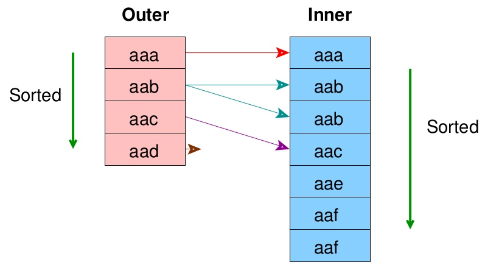

## 실행계획

### 실행계획이란?

쿼리가 요구한 데이터를 추출하기 위해 `DBMS`가 차례로 수행하는 전략.

<br/>

### 샘플 데이터 생성

```sql
-- Create Table.
CREATE TABLE Location (
    id int PRIMARY KEY,
    x int NOT NULL,
    y int NOT NULL,
    z int NOT NULL
);

CREATE TABLE Building (
    location_id int PRIMARY KEY REFERENCES Location(id),
    name text
);


-- Create Data.
INSERT INTO Location
SELECT
    id,
    trunc(random()*10000) AS x,
    trunc(random()*10000) AS y,
    trunc(random()*10000) AS z
FROM generate_series(0, 1000000) AS id;

INSERT INTO Building
SELECT
    trunc(random()*1000000) AS location_id,
    md5(random()::text) AS name
FROM generate_series(0, 1000000)
ON CONFLICT (location_id) DO NOTHING;


-- Create Index.
CREATE INDEX idx_location_x_y ON Location(x, y);
CREATE INDEX idx_location_z ON Location(z);
```

<br/>

## 데이터 읽기

### Seq Scan

테이블의 `모든 페이지`를 읽어서 모든 데이터를 메모리에 적재합니다. 건당 읽기속도가 매우 빠르기 때문에, 대부분의 튜플이 요구되거나, 테이블의 크기가 작다면, `인덱스 스캔`보다 훨씬 빠르게 데이터를 가져올 수 있습니다. 단, 모든 튜플을 읽기 때문에, 대용량 테이블에서 소량의 데이터만 추출하는 경우에는 병목으로 작용할 수 있습니다.

;

```sql
EXPLAIN
SELECT * FROM LOCATION;
```

```text
 QUERY PLAN
-------------------------------------------------------------------
 Seq Scan on location  (cost=0.00..15406.01 rows=1000001 width=16)
```

<br/>

### Index Scan

인덱스를 타고 `조건절`을 만족하는 데이터만 메모리에 적재합니다. 건당 읽기속도는 `순차 스캔`보다는 느리지만, 조건절을 만족하는 행만 가져올 수 있으므로, 대용량 테이블에서 소량의 데이터를 가져오는 경우에 적합합니다.

;

```text
EXPLAIN SELECT * FROM LOCATION
WHERE x = 404 AND y = 404;

 QUERY PLAN
----------------------------------------------------------------------------------
 Index Scan using idx_location_x_y on location  (cost=0.42..8.45 rows=1 width=16)
   Index Cond: ((x = 404) AND (y = 404))
```

<br/>

단, 테이블의 대부분을 읽어야 된다면 `순차 스캔`이 선택될 수 있습니다.

;

```text
EXPLAIN SELECT * FROM LOCATION
WHERE x != 404 AND y != 404;

 QUERY PLAN
------------------------------------------------------------------
 Seq Scan on location  (cost=0.00..20406.01 rows=999801 width=16)
   Filter: ((x <> 404) AND (y <> 404))
```

<br/>

### Index Only Scan

인덱스 이외의 컬럼을 사용하지 않았다면, 인덱스만 읽어도 모든 데이터를 가져올 수 있습니다. 즉, 테이블 액세스가 발생하지 않습니다.

```text
EXPLAIN SELECT x, y FROM LOCATION
WHERE x < 5 AND y < 5;

 QUERY PLAN
---------------------------------------------------------------------------------------
 Index Only Scan using idx_location_x_y on location  (cost=0.42..24.26 rows=1 width=8)
   Index Cond: ((x < 5) AND (y < 5))
```

<br/>

### Bitmap Index Scan

`순차 스캔`으로 읽기에는 적고 `인덱스 스캔`으로 읽기에는 많은 경우, `PostgreSQL`은 `비트맵 인덱스 스캔`을 선택합니다. 먼저 인덱스를 사용하여 `읽어야 할 페이지`에 체크한 뒤, 체크된 페이지만 빠르게 읽습니다.

;

```text
EXPLAIN SELECT * FROM LOCATION
WHERE x < 100;

 QUERY PLAN
------------------------------------------------------------------------------------
 Bitmap Heap Scan on location  (cost=176.48..5866.96 rows=9298 width=16)
   Recheck Cond: (x < 100)
   ->  Bitmap Index Scan on idx_location_x_y  (cost=0.00..174.16 rows=9298 width=0)
         Index Cond: (x < 100)
```

<br/>

여러개의 인덱스를 함께 사용할 수 있습니다.


```text
EXPLAIN SELECT * FROM LOCATION
WHERE x < 100 AND z < 100;

 QUERY PLAN
------------------------------------------------------------------------------------------
 Bitmap Heap Scan on location  (cost=354.02..673.65 rows=88 width=16)
   Recheck Cond: ((x < 100) AND (z < 100))
   ->  BitmapAnd  (cost=354.02..354.02 rows=88 width=0)
         ->  Bitmap Index Scan on idx_location_x_y  (cost=0.00..174.16 rows=9298 width=0)
               Index Cond: (x < 100)
         ->  Bitmap Index Scan on idx_location_z  (cost=0.00..179.56 rows=9485 width=0)
               Index Cond: (z < 100)
```

<br/>

`OR`도 가능합니다.

```text
EXPLAIN SELECT * FROM LOCATION
WHERE x < 100 OR z < 100;

 QUERY PLAN
------------------------------------------------------------------------------------------
 Bitmap Heap Scan on location  (cost=363.07..6050.81 rows=18695 width=16)
   Recheck Cond: ((x < 100) OR (z < 100))
   ->  BitmapOr  (cost=363.07..363.07 rows=18783 width=0)
         ->  Bitmap Index Scan on idx_location_x_y  (cost=0.00..174.16 rows=9298 width=0)
               Index Cond: (x < 100)
         ->  Bitmap Index Scan on idx_location_z  (cost=0.00..179.56 rows=9485 width=0)
               Index Cond: (z < 100)
```

<br/>

### Parallel Seq Scan

병렬로 데이터를 읽어, 각각에서 읽은 결과를 합칩니다(=`Gahter`). 조건절이 주어졌으나 연관된 인덱스가 없는 경우, 조건을 만족하는 행을 찾아내기 위한 차선책으로 사용됩니다. 결과 건수가 낮을수록 그나마 비용도 낮아집니다.


**결과 집합이 적은 경우 :**

```text
EXPLAIN SELECT * FROM LOCATION
WHERE y = 100;

                                 QUERY PLAN
-----------------------------------------------------------------------------
 Gather  (cost=1000.00..11624.34 rows=100 width=16)
   Workers Planned: 2
   ->  Parallel Seq Scan on location  (cost=0.00..10614.34 rows=42 width=16)
         Filter: (y = 100)
```

<br/>

**결과 집합이 많은 경우 :**

```text
EXPLAIN SELECT * FROM LOCATION
WHERE y BETWEEN 10 AND 100;

                                 QUERY PLAN
-----------------------------------------------------------------------------
 Gather  (cost=1000.00..13472.71 rows=8167 width=16)
   Workers Planned: 2
   ->  Parallel Seq Scan on location  (cost=0.00..11656.01 rows=3403 width=16)
         Filter: ((y >= 10) AND (y <= 100))
```

<br/>

### With `Limit` Clause

#### On Seq Scan

`Limit`절을 사용하여 `Seq Scan`의 범위를 좁힐 수 있습니다.


**Limit을 사용하지 않은 경우 :**

```text
EXPLAIN SELECT * FROM LOCATION;

 QUERY PLAN
-------------------------------------------------------------------
 Seq Scan on location  (cost=0.00..15406.01 rows=1000001 width=16)
```

<br/>

**Limit을 사용한 경우 :**

```text
EXPLAIN SELECT * FROM LOCATION LIMIT 10;

 QUERY PLAN
-------------------------------------------------------------------------
 Limit  (cost=0.00..0.15 rows=10 width=16)
   ->  Seq Scan on location  (cost=0.00..15406.01 rows=1000001 width=16)
```

<br/>

#### On Index Scan

선택된 행이 너무 많아 `Seq Scan`으로 변경되는 경우에 사용하면 스캔 범위를 좁혀서 비용을 줄일 수 있습니다. `Limit`을 사용한 경우, 최종 최대비용이 `0.18`로 줄어든 것에 주목해주세요.

**Limit을 사용하지 않은 경우 :**

```text
EXPLAIN SELECT * FROM LOCATION WHERE x > 10;

 QUERY PLAN
-------------------------------------------------------------------
 Seq Scan on location  (cost=0.00..17906.01 rows=998671 width=16)
   Filter: (x > 10)
```

<br/>

**Limit을 사용한 경우 :**

```text
EXPLAIN SELECT * FROM LOCATION WHERE x > 10 LIMIT 10;

 QUERY PLAN
------------------------------------------------------------------------
 Limit  (cost=0.00..0.18 rows=10 width=16)
   ->  Seq Scan on location  (cost=0.00..17906.01 rows=998671 width=16)
         Filter: (x > 10)
```

<br/>

#### On Bitmap Index Scan

`Index Scan`의 결과행이 많아서 `Bitmap Index Scan`으로 변질된 경우, `Limit`을 사용하여 `Index Scan`으로 되돌릴 수 있습니다.

**Limit을 사용하지 않은 경우 :**

```text
EXPLAIN SELECT * FROM LOCATION WHERE x BETWEEN 10 AND 100;

 QUERY PLAN
-------------------------------------------------------------------
 Bitmap Heap Scan on location  (cost=176.16..5960.13 rows=8169 width=16)
   Recheck Cond: ((x >= 10) AND (x <= 100))
   ->  Bitmap Index Scan on idx_location_x_y  (cost=0.00..174.12 rows=8169 width=0)
         Index Cond: ((x >= 10) AND (x <= 100))
```

<br/>

**Limit을 사용한 경우 :**

```text
EXPLAIN SELECT * FROM LOCATION WHERE x BETWEEN 10 AND 100 LIMIT 10;

 QUERY PLAN
------------------------------------------------------------------------
 Limit  (cost=0.42..23.53 rows=10 width=16)
   ->  Index Scan using idx_location_x_y on location  (cost=0.42..18871.09 rows=8169 width=16)
         Index Cond: ((x >= 10) AND (x <= 100))
```

<br/>

### With `Offset` Clause

`Offset`절은 실행계획에서 `Limit`으로 나타나지만 범위 축소에는 기여하지 않습니다.

**Offset 사용 전:**

```text
EXPLAIN SELECT * FROM LOCATION;

 QUERY PLAN
-------------------------------------------------------------------
 Seq Scan on location  (cost=0.00..15406.01 rows=1000001 width=16)
```

<br/>

**Offset 사용 후:**

```text
EXPLAIN SELECT * FROM LOCATION OFFSET 100000;

 QUERY PLAN
-------------------------------------------------------------------------
 Limit  (cost=1540.60..15406.01 rows=900001 width=16)
   ->  Seq Scan on location  (cost=0.00..15406.01 rows=1000001 width=16)
```

<br/>

## 조인

### Nested Loop Join

`Nested Loop`를 통해 두 테이블에서 발생할 수 있는 모든 튜플을 생성한 뒤, 조인 조건에 일치하는 튜플만 골라냅니다. `최초 N건 가져오기`에 매우 적합하며, 의사코드로 표현하면 다음과 같습니다.

```cpp
for(auto outerRow : outerTable){
      for(auto innerRow : innerTable){
            if(outerRow.id == innerRow.id){
                  out(outerRow, innerRow);
            }
      }
}
```

<br/>

#### With Seq Scan

`Nested Loop Join`의 기본 매커니즘은 `Outer Table`의 행 개수만큼 `Inner Table`의 모든 아이템을 반복적으로 조회(=`Seq Scan`)하는 것이므로 성능에 매우 불리합니다. 이것은 개념상으로만 존재하는 실행계획이며, 실제 환경에서는 데이터베이스가 `Sort-Merge Join`으로 변경하여 최적화를 시도합니다.


<br/>

#### With Index Scan

두 테이블 중 하나라도 조인컬럼에 인덱스가 걸려있다면 `Seq Scan`대신 `Index Scan`을 사용하여 매우 드라마틱한 성능 향상을 기대할 수 있습니다. 두 테이블 중 하나만 인덱스가 걸려있는 경우 인덱스가 걸려있는 테이블을 `Inner Table`로 고정합니다. 만약 두 테이블 모두 인덱스가 걸려있는 경우, 행의 개수가 적은것을 `Outer Table`로 고정합니다. 왜냐하면 `Index Scan`의 발생횟수는 `Outer Table`의 행 개수와 같기 때문에, `Outer Table`이 작아야만 `Index Scan` 횟수를 줄일 수 있기 때문입니다.


<br/>

`Outer Table`의 크기가 실제 실행계획에 영향을 주는지 테스트해보겠습니다. 아래의 쿼리는 다음 같은 순서로 수행됩니다.

```sql
SELECT * FROM Location, Building
WHERE id = location_id AND id < 10 AND location_id < 10000
LIMIT 5;
```

**쿼리 순서 :**

1. `Location`에서 `id < 10`인 항목을 추출한다.
2. `Building`에서 `location_id < 10000`인 항목을 추출한다.
3. `id = location_id`인 항목을 5건만 추출한다.

<br/>

`Location`에서 읽은 데이터가 `Building`에서 읽은 데이터보다 적으므로, 실행계획에서 `Location`이 `Outer Table`로 선택될 가능성이 매우 높습니다. 실제로 위의 쿼리의 실행계획을 살펴보면, `Location`이 `Building`보다 위에 있으므로 `Outer Table`로 선택된 것을 확인할 수 있습니다.

```text
 QUERY PLAN
----------------------------------------------------------------------------------------
 Limit  (cost=0.85..93.05 rows=1 width=53) (actual time=0.010..0.031 rows=5 loops=1)
   ->  Nested Loop  (cost=0.85..93.05 rows=1 width=53) (actual time=0.010..0.030 rows=5 loops=1)
         ->  Index Scan using location_pkey on location  (cost=0.42..8.60 rows=10 width=16) (actual time=0.004..0.005 rows=8 loops=1)
               Index Cond: (id < 10)
         ->  Index Scan using building_pkey on building  (cost=0.42..8.45 rows=1 width=37) (actual time=0.002..0.002 rows=1 loops=8)
               Index Cond: ((location_id = location.id) AND (location_id < 10000))
```

<br/>

반대로 `Building`에서 읽은 데이터가 더 작다면 `Building`이 `Outer Table`로 선택될 것 입니다.

```text
SELECT * FROM Location, Building
WHERE id = location_id AND id < 10000 AND location_id < 10
LIMIT 5;

 QUERY PLAN
----------------------------------------------------------------------------------------
 Limit  (cost=0.85..91.66 rows=1 width=53) (actual time=0.013..0.031 rows=5 loops=1)
   ->  Nested Loop  (cost=0.85..91.66 rows=1 width=53) (actual time=0.012..0.029 rows=5 loops=1)
         ->  Index Scan using building_pkey on building  (cost=0.42..32.55 rows=7 width=37) (actual time=0.004..0.011 rows=5 loops=1)
               Index Cond: (location_id < 10)
         ->  Index Scan using location_pkey on location  (cost=0.42..8.45 rows=1 width=16) (actual time=0.003..0.003 rows=1 loops=5)
               Index Cond: ((id = building.location_id) AND (id < 10000))
```

<br/>

### Sort Merge Join

조인량이 많아 `Nested Loop Join`으로 처리하기 벅차다면 `Sort Merge Join`을 고려합니다. `Outer Table`과 `Inner Table`을 조인 컬럼으로 정렬하고 조인을 수행한 뒤 결과들을 전부 합쳐서 반환합니다. `Outer Table`과 `Inner Table`을 한번씩만 읽기 때문에 대용량 테이블의 조인에 효과적이지만, `정렬 작업`이 어마무시하다고 판단되면 다른 조인 방식이 선택될 수 있습니다. 하지만 조인 컬럼에 인덱스가 걸려 있다면, 이를 사용하여 정렬 작업을 생략할 수 있습니다.



아래의 예시를 보면, `Nested Loop Join`로 처리할 경우에는 `Inner Table Scan`이 1000번 가량 발생되기 때문에, 차라리 `Merge Join`이 낫다고 판단한 것을 확인할 수 있습니다.

```text
SELECT * FROM Location, Building
WHERE id = location_id
LIMIT 1000;

 QUERY PLAN
----------------------------------------------------------------------------------------
 Limit  (cost=3.06..131.73 rows=1000 width=53) (actual time=0.014..1.760 rows=1000 loops=1)
   ->  Merge Join  (cost=3.06..81299.05 rows=631802 width=53) (actual time=0.013..1.687 rows=1000 loops=1)
         Merge Cond: (location.id = building.location_id)
         ->  Index Scan using location_pkey on location  (cost=0.42..31389.44 rows=1000001 width=16) (actual time=0.006..0.259 rows=1582 loops=1)
         ->  Index Scan using building_pkey on building  (cost=0.42..39513.45 rows=631802 width=37) (actual time=0.004..0.976 rows=1000 loops=1)
```

<br/>

하지만 `LIMIT`의 수가 적다면 `Inner Table Scan`도 적어지기 때문에 `Nested Loop Join`으로 풀릴 수 있습니다.

```text
SELECT * FROM Location, Building
WHERE x = location_id
LIMIT 10;

 QUERY PLAN
----------------------------------------------------------------------------------------
 Limit  (cost=0.42..5.30 rows=10 width=53) (actual time=0.025..0.115 rows=10 loops=1)
   ->  Nested Loop  (cost=0.42..487942.36 rows=1000001 width=53) (actual time=0.024..0.114 rows=10 loops=1)
         ->  Seq Scan on location  (cost=0.00..15406.01 rows=1000001 width=16) (actual time=0.013..0.015 rows=18 loops=1)
         ->  Index Scan using building_pkey on building  (cost=0.42..0.47 rows=1 width=37) (actual time=0.005..0.005 rows=1 loops=18)
               Index Cond: (location_id = location.x)
```

<br/>

### Hash Join

대용량이지만 `Sort Merge Join`에서 정렬을 수행하기 벅찬경우, 정렬 대신에 `해싱`이 선택될 수 있습니다. `Inner Table`의 각 튜플을 해싱하고, 같은 해시값을 갖는 튜플을 모아서 메인 메모리에 적재한 뒤, `Outer Table`의 각 튜플 해시값과 비교하면서 조인을 진행합니다.

<br/>

`Nested Loop Join`처럼 여러번 스캔하지도 않고, `Sort Merge Join`처럼 정렬부하도 없지만, 해시의 특성상 동등비교 이외에는 사용될 수 없습니다. 또한, 해시 테이블이 메인 메모리에 적재되어야 하기 때문에 `Inner Table`의 크기가 작아야 유리합니다.


아래 예제에서 크기가 더 작은 `Building`이 `Inner Table`로 선택되었음을 확인할 수 있습니다.

```text
SELECT * FROM Location, Building
WHERE x = location_id;

 QUERY PLAN
----------------------------------------------------------------------------------------
 Hash Join  (cost=24417.55..57150.58 rows=1000001 width=53) (actual time=206.794..938.995 rows=629577 loops=1)
   Hash Cond: (location.x = building.location_id)
   ->  Seq Scan on location  (cost=0.00..15406.01 rows=1000001 width=16) (actual time=0.015..67.029 rows=1000001 loops=1)
   ->  Hash  (cost=11584.02..11584.02 rows=631802 width=37) (actual time=202.027..202.027 rows=631802 loops=1)
         Buckets: 65536  Batches: 16  Memory Usage: 3166kB
         ->  Seq Scan on building  (cost=0.00..11584.02 rows=631802 width=37) (actual time=0.011..42.686 rows=631802 loops=1)
```
